# EduNexus Developer Platform — Backend Implementation Specification
## developers.edunexus.co.ke

**Version:** 1.0
**Status:** Authoritative Backend Implementation Reference
**Audience:** Staff Engineers · Principal Engineers · Platform Engineers · API Engineers · AI Infrastructure Engineers · Backend Engineers
**Date:** 2026-06-30

---

> This specification defines every backend system required to operate developers.edunexus.co.ke. It is implementation-ready: every chapter includes schema, interfaces, endpoints, sequence diagrams, RLS policies, rate limiting, security controls, observability, and testing strategy. The frontend is assumed to exist. Engineers reading this document should be able to translate each chapter into production code without additional design work.

---

## Table of Contents

- [Part I — Developer Identity](#part-i--developer-identity)
- [Part II — Projects](#part-ii--projects)
- [Part III — API Keys](#part-iii--api-keys)
- [Part IV — API Gateway](#part-iv--api-gateway)
- [Part V — AI Gateway](#part-v--ai-gateway)
- [Part VI — Educational Knowledge Graph Service](#part-vi--educational-knowledge-graph-service)
- [Part VII — Marketplace Backend](#part-vii--marketplace-backend)
- [Part VIII — Webhooks](#part-viii--webhooks)
- [Part IX — Billing](#part-ix--billing)
- [Part X — Analytics](#part-x--analytics)
- [Part XI — Infrastructure](#part-xi--infrastructure)
- [Part XII — Security](#part-xii--security)
- [Part XIII — Production Readiness](#part-xiii--production-readiness)

---

# Part I — Developer Identity

---

## 1.1 Architecture Overview

The developer identity system is the authentication and authorization foundation for the entire platform. It handles personal accounts, team accounts, organizations, OAuth flows, role-based membership, invitations, and audit logging.

**Primary services:**
- `identity-service` — owns all identity mutation logic
- `auth-middleware` — validates sessions on every request
- `audit-service` — records all identity events to append-only log

**Technology stack:**
- Supabase Auth (JWT issuance, OAuth providers)
- PostgreSQL (organizational data, memberships, roles)
- Redis (session cache, invitation tokens)
- Resend (invitation and welcome emails)

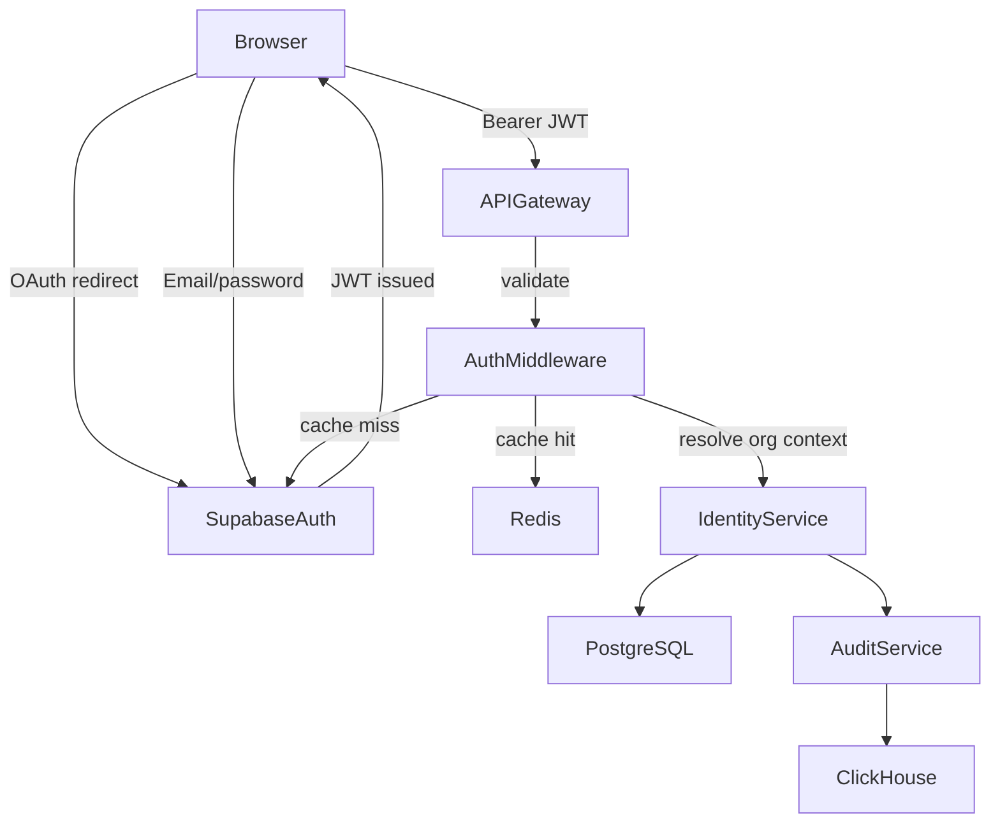

---

## 1.2 PostgreSQL Schema

```sql
-- Developer profiles (one per auth.users row)
CREATE TABLE developer_profiles (
  id            UUID PRIMARY KEY DEFAULT gen_random_uuid(),
  user_id       UUID NOT NULL UNIQUE REFERENCES auth.users(id) ON DELETE CASCADE,
  display_name  TEXT NOT NULL,
  avatar_url    TEXT,
  bio           TEXT,
  website_url   TEXT,
  github_handle TEXT,
  github_id     TEXT UNIQUE,
  google_id     TEXT UNIQUE,
  mfa_enabled   BOOLEAN NOT NULL DEFAULT false,
  created_at    TIMESTAMPTZ NOT NULL DEFAULT now(),
  updated_at    TIMESTAMPTZ NOT NULL DEFAULT now()
);
CREATE INDEX developer_profiles_user_id_idx ON developer_profiles(user_id);
CREATE INDEX developer_profiles_github_id_idx ON developer_profiles(github_id) WHERE github_id IS NOT NULL;

-- Organizations
CREATE TABLE organizations (
  id            UUID PRIMARY KEY DEFAULT gen_random_uuid(),
  slug          TEXT NOT NULL UNIQUE,
  name          TEXT NOT NULL,
  avatar_url    TEXT,
  plan          TEXT NOT NULL DEFAULT 'free' CHECK (plan IN ('free','starter','growth','enterprise')),
  billing_email TEXT NOT NULL,
  owner_id      UUID NOT NULL REFERENCES developer_profiles(id),
  created_at    TIMESTAMPTZ NOT NULL DEFAULT now(),
  updated_at    TIMESTAMPTZ NOT NULL DEFAULT now()
);
CREATE UNIQUE INDEX organizations_slug_idx ON organizations(slug);
CREATE INDEX organizations_owner_id_idx ON organizations(owner_id);

-- Organization members
CREATE TYPE org_role AS ENUM ('owner','admin','member','billing','viewer');

CREATE TABLE organization_members (
  id              UUID PRIMARY KEY DEFAULT gen_random_uuid(),
  organization_id UUID NOT NULL REFERENCES organizations(id) ON DELETE CASCADE,
  developer_id    UUID NOT NULL REFERENCES developer_profiles(id) ON DELETE CASCADE,
  role            org_role NOT NULL DEFAULT 'member',
  invited_by      UUID REFERENCES developer_profiles(id),
  joined_at       TIMESTAMPTZ NOT NULL DEFAULT now(),
  created_at      TIMESTAMPTZ NOT NULL DEFAULT now(),
  updated_at      TIMESTAMPTZ NOT NULL DEFAULT now(),
  UNIQUE(organization_id, developer_id)
);
CREATE INDEX org_members_organization_id_idx ON organization_members(organization_id);
CREATE INDEX org_members_developer_id_idx ON organization_members(developer_id);

-- Invitations
CREATE TABLE organization_invitations (
  id              UUID PRIMARY KEY DEFAULT gen_random_uuid(),
  organization_id UUID NOT NULL REFERENCES organizations(id) ON DELETE CASCADE,
  email           TEXT NOT NULL,
  role            org_role NOT NULL DEFAULT 'member',
  token           TEXT NOT NULL UNIQUE,
  invited_by      UUID NOT NULL REFERENCES developer_profiles(id),
  expires_at      TIMESTAMPTZ NOT NULL DEFAULT (now() + INTERVAL '7 days'),
  accepted_at     TIMESTAMPTZ,
  revoked_at      TIMESTAMPTZ,
  created_at      TIMESTAMPTZ NOT NULL DEFAULT now(),
  updated_at      TIMESTAMPTZ NOT NULL DEFAULT now()
);
CREATE INDEX invitations_organization_id_idx ON organization_invitations(organization_id);
CREATE INDEX invitations_token_idx ON organization_invitations(token);
CREATE INDEX invitations_email_idx ON organization_invitations(email);

-- Audit log (append-only, no updates or deletes)
CREATE TABLE identity_audit_log (
  id              UUID PRIMARY KEY DEFAULT gen_random_uuid(),
  actor_id        UUID REFERENCES developer_profiles(id),
  organization_id UUID REFERENCES organizations(id),
  action          TEXT NOT NULL,
  target_type     TEXT NOT NULL,
  target_id       TEXT NOT NULL,
  metadata        JSONB NOT NULL DEFAULT '{}',
  ip_address      INET,
  user_agent      TEXT,
  created_at      TIMESTAMPTZ NOT NULL DEFAULT now()
);
CREATE INDEX audit_log_actor_id_idx ON identity_audit_log(actor_id);
CREATE INDEX audit_log_organization_id_idx ON identity_audit_log(organization_id);
CREATE INDEX audit_log_created_at_idx ON identity_audit_log(created_at DESC);
```

---

## 1.3 TypeScript Interfaces

```typescript
export type OrgRole = 'owner' | 'admin' | 'member' | 'billing' | 'viewer';
export type OrgPlan = 'free' | 'starter' | 'growth' | 'enterprise';

export type DeveloperProfile = {
  id: string;
  userId: string;
  displayName: string;
  avatarUrl: string | null;
  bio: string | null;
  websiteUrl: string | null;
  githubHandle: string | null;
  mfaEnabled: boolean;
  createdAt: string;
  updatedAt: string;
};

export type Organization = {
  id: string;
  slug: string;
  name: string;
  avatarUrl: string | null;
  plan: OrgPlan;
  billingEmail: string;
  ownerId: string;
  createdAt: string;
  updatedAt: string;
};

export type OrganizationMember = {
  id: string;
  organizationId: string;
  developerId: string;
  role: OrgRole;
  invitedBy: string | null;
  joinedAt: string;
};

export type OrganizationInvitation = {
  id: string;
  organizationId: string;
  email: string;
  role: OrgRole;
  token: string;
  invitedBy: string;
  expiresAt: string;
  acceptedAt: string | null;
  revokedAt: string | null;
};

export type IdentityAuditEntry = {
  id: string;
  actorId: string | null;
  organizationId: string | null;
  action: string;
  targetType: string;
  targetId: string;
  metadata: Record<string, unknown>;
  ipAddress: string | null;
  userAgent: string | null;
  createdAt: string;
};

export type SessionContext = {
  userId: string;
  developerId: string;
  activeOrganizationId: string | null;
  role: OrgRole | null;
  scopes: string[];
};
```

---

## 1.4 RLS Policies

```sql
-- Developer profiles: read own, update own
ALTER TABLE developer_profiles ENABLE ROW LEVEL SECURITY;

CREATE POLICY "developer_profiles_select_own"
  ON developer_profiles FOR SELECT
  USING (user_id = auth.uid());

CREATE POLICY "developer_profiles_update_own"
  ON developer_profiles FOR UPDATE
  USING (user_id = auth.uid());

-- Organizations: members can read, owners/admins can update
ALTER TABLE organizations ENABLE ROW LEVEL SECURITY;

CREATE POLICY "organizations_select_member"
  ON organizations FOR SELECT
  USING (
    id IN (
      SELECT organization_id FROM organization_members om
      JOIN developer_profiles dp ON dp.id = om.developer_id
      WHERE dp.user_id = auth.uid()
    )
  );

CREATE POLICY "organizations_update_owner_admin"
  ON organizations FOR UPDATE
  USING (
    id IN (
      SELECT organization_id FROM organization_members om
      JOIN developer_profiles dp ON dp.id = om.developer_id
      WHERE dp.user_id = auth.uid()
        AND om.role IN ('owner', 'admin')
    )
  );

-- Organization members: visible to org members
ALTER TABLE organization_members ENABLE ROW LEVEL SECURITY;

CREATE POLICY "org_members_select"
  ON organization_members FOR SELECT
  USING (
    organization_id IN (
      SELECT organization_id FROM organization_members om2
      JOIN developer_profiles dp ON dp.id = om2.developer_id
      WHERE dp.user_id = auth.uid()
    )
  );

-- Invitations: visible to org admins/owners
ALTER TABLE organization_invitations ENABLE ROW LEVEL SECURITY;

CREATE POLICY "invitations_select_admin"
  ON organization_invitations FOR SELECT
  USING (
    organization_id IN (
      SELECT organization_id FROM organization_members om
      JOIN developer_profiles dp ON dp.id = om.developer_id
      WHERE dp.user_id = auth.uid()
        AND om.role IN ('owner', 'admin')
    )
  );

-- Audit log: read-only for org admins/owners, no writes via RLS
ALTER TABLE identity_audit_log ENABLE ROW LEVEL SECURITY;

CREATE POLICY "audit_log_select_admin"
  ON identity_audit_log FOR SELECT
  USING (
    organization_id IN (
      SELECT organization_id FROM organization_members om
      JOIN developer_profiles dp ON dp.id = om.developer_id
      WHERE dp.user_id = auth.uid()
        AND om.role IN ('owner', 'admin')
    )
  );
```

---

## 1.5 REST Endpoints

```
POST   /v1/identity/profile                  → create developer profile (called post-OAuth)
GET    /v1/identity/profile                  → get own profile
PATCH  /v1/identity/profile                  → update own profile

POST   /v1/organizations                     → create organization
GET    /v1/organizations                     → list own organizations
GET    /v1/organizations/:slug               → get organization by slug
PATCH  /v1/organizations/:orgId              → update organization (admin/owner)
DELETE /v1/organizations/:orgId              → delete organization (owner only)

GET    /v1/organizations/:orgId/members      → list members
DELETE /v1/organizations/:orgId/members/:id  → remove member (admin/owner)
PATCH  /v1/organizations/:orgId/members/:id  → update member role (owner only)

POST   /v1/organizations/:orgId/invitations  → send invitation
GET    /v1/organizations/:orgId/invitations  → list pending invitations
DELETE /v1/organizations/:orgId/invitations/:id → revoke invitation

POST   /v1/invitations/:token/accept         → accept invitation (authenticated user)

GET    /v1/organizations/:orgId/audit-log    → paginated audit log (admin/owner)

POST   /v1/auth/switch-organization          → switch active organization context
```

---

## 1.6 Sequence Diagrams

### OAuth Login + Profile Bootstrap

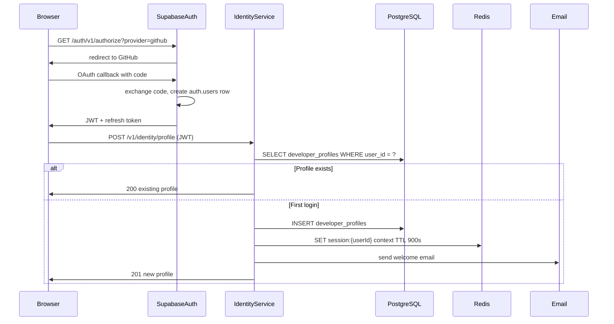

### Organization Invitation Flow

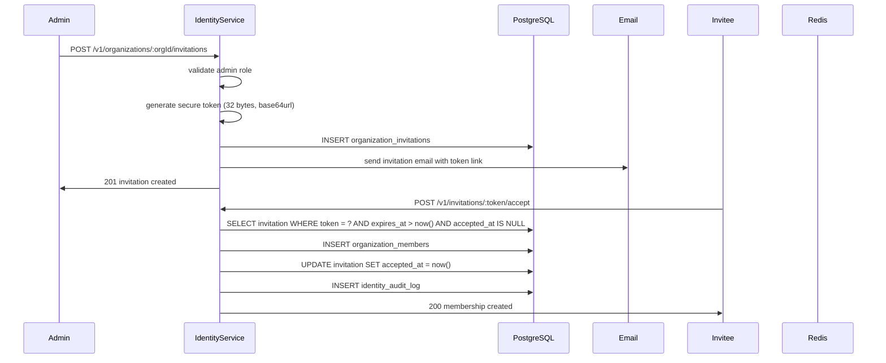

---

## 1.7 Rate Limiting

| Endpoint | Limit | Window |
|----------|-------|--------|
| POST /v1/organizations/:orgId/invitations | 10 | 1 hour per org |
| POST /v1/invitations/:token/accept | 5 | 15 min per IP |
| POST /v1/auth/switch-organization | 30 | 1 min per user |
| GET /v1/organizations/:orgId/audit-log | 60 | 1 min per user |

---

## 1.8 Security

- Invitation tokens: 32 bytes from `crypto.randomBytes`, base64url-encoded, stored as bcrypt hash, compared in constant time
- JWT validation: verified on every request via Supabase Auth public key, not trusted from request body
- Organization switching: server sets `activeOrganizationId` in Redis session — never trusted from client claim
- Audit log: append-only, no UPDATE/DELETE RLS policy, service role writes only
- MFA: enforced at Supabase Auth layer, TOTP-based, recovery codes issued on setup

---

## 1.9 Observability

```typescript
// Structured log fields on every identity operation
type IdentityLogEntry = {
  service: 'identity-service';
  action: string;
  developerId: string;
  organizationId: string | null;
  durationMs: number;
  success: boolean;
  errorCode: string | null;
};
```

Metrics to emit to ClickHouse:
- `identity.login.success` / `identity.login.failure` — by provider
- `identity.invitation.sent` / `identity.invitation.accepted` / `identity.invitation.expired`
- `identity.org.created` / `identity.org.member.added` / `identity.org.member.removed`
- `identity.switch_org.latency_ms`

---

## 1.10 Testing Strategy

```typescript
// Unit tests
describe('OrganizationService', () => {
  it('enforces owner-only role changes', async () => { ... });
  it('rejects expired invitation tokens', async () => { ... });
  it('prevents self-removal of last owner', async () => { ... });
});

// Integration tests (real Supabase local instance)
describe('invitation flow', () => {
  it('creates member row on accept', async () => { ... });
  it('writes audit log entry on role change', async () => { ... });
  it('rate-limits invitation sends per org', async () => { ... });
});

// RLS policy tests
describe('RLS: organization_members', () => {
  it('non-member cannot read member list', async () => { ... });
  it('member can read member list', async () => { ... });
  it('viewer cannot update member role', async () => { ... });
});
```

---

# Part II — Projects

---

## 2.1 Architecture Overview

Each developer or organization owns **projects**. A project is the container for all platform resources: API credentials, environment variables, plugin configurations, webhook subscriptions, and billing. Every project has exactly two environments: `sandbox` and `production`. These are not separate databases — they are first-class entities in the schema that determine quota enforcement, AI model routing, and data isolation.

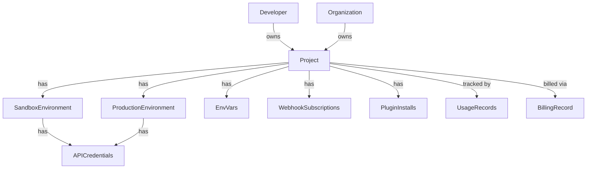

---

## 2.2 PostgreSQL Schema

```sql
CREATE TYPE environment_type AS ENUM ('sandbox', 'production');
CREATE TYPE project_status AS ENUM ('active', 'suspended', 'deleted');

CREATE TABLE projects (
  id              UUID PRIMARY KEY DEFAULT gen_random_uuid(),
  owner_type      TEXT NOT NULL CHECK (owner_type IN ('developer', 'organization')),
  owner_id        UUID NOT NULL,
  name            TEXT NOT NULL,
  slug            TEXT NOT NULL,
  description     TEXT,
  status          project_status NOT NULL DEFAULT 'active',
  plan            TEXT NOT NULL DEFAULT 'free',
  created_at      TIMESTAMPTZ NOT NULL DEFAULT now(),
  updated_at      TIMESTAMPTZ NOT NULL DEFAULT now(),
  UNIQUE(owner_id, slug)
);
CREATE INDEX projects_owner_id_idx ON projects(owner_id);
CREATE INDEX projects_status_idx ON projects(status);

CREATE TABLE project_environments (
  id              UUID PRIMARY KEY DEFAULT gen_random_uuid(),
  project_id      UUID NOT NULL REFERENCES projects(id) ON DELETE CASCADE,
  environment     environment_type NOT NULL,
  created_at      TIMESTAMPTZ NOT NULL DEFAULT now(),
  updated_at      TIMESTAMPTZ NOT NULL DEFAULT now(),
  UNIQUE(project_id, environment)
);
CREATE INDEX project_environments_project_id_idx ON project_environments(project_id);

CREATE TABLE project_env_vars (
  id              UUID PRIMARY KEY DEFAULT gen_random_uuid(),
  project_id      UUID NOT NULL REFERENCES projects(id) ON DELETE CASCADE,
  environment     environment_type NOT NULL,
  key             TEXT NOT NULL,
  value_encrypted BYTEA NOT NULL,
  created_at      TIMESTAMPTZ NOT NULL DEFAULT now(),
  updated_at      TIMESTAMPTZ NOT NULL DEFAULT now(),
  UNIQUE(project_id, environment, key)
);
CREATE INDEX project_env_vars_project_id_idx ON project_env_vars(project_id);

CREATE TABLE project_members (
  id              UUID PRIMARY KEY DEFAULT gen_random_uuid(),
  project_id      UUID NOT NULL REFERENCES projects(id) ON DELETE CASCADE,
  developer_id    UUID NOT NULL REFERENCES developer_profiles(id) ON DELETE CASCADE,
  role            org_role NOT NULL DEFAULT 'member',
  created_at      TIMESTAMPTZ NOT NULL DEFAULT now(),
  updated_at      TIMESTAMPTZ NOT NULL DEFAULT now(),
  UNIQUE(project_id, developer_id)
);
CREATE INDEX project_members_project_id_idx ON project_members(project_id);
CREATE INDEX project_members_developer_id_idx ON project_members(developer_id);
```

---

## 2.3 TypeScript Interfaces

```typescript
export type EnvironmentType = 'sandbox' | 'production';
export type ProjectStatus = 'active' | 'suspended' | 'deleted';

export type Project = {
  id: string;
  ownerType: 'developer' | 'organization';
  ownerId: string;
  name: string;
  slug: string;
  description: string | null;
  status: ProjectStatus;
  plan: string;
  createdAt: string;
  updatedAt: string;
};

export type ProjectEnvironment = {
  id: string;
  projectId: string;
  environment: EnvironmentType;
};

export type ProjectEnvVar = {
  id: string;
  projectId: string;
  environment: EnvironmentType;
  key: string;
  // value is never returned in API responses — write-only after creation
};

export type CreateProjectInput = {
  name: string;
  slug: string;
  description?: string;
  ownerType: 'developer' | 'organization';
  ownerId: string;
};
```

---

## 2.4 RLS Policies

```sql
ALTER TABLE projects ENABLE ROW LEVEL SECURITY;

CREATE POLICY "projects_select_member"
  ON projects FOR SELECT
  USING (
    id IN (
      SELECT project_id FROM project_members pm
      JOIN developer_profiles dp ON dp.id = pm.developer_id
      WHERE dp.user_id = auth.uid()
    )
    OR (
      owner_type = 'developer' AND owner_id IN (
        SELECT id FROM developer_profiles WHERE user_id = auth.uid()
      )
    )
  );

CREATE POLICY "projects_insert_owner"
  ON projects FOR INSERT
  WITH CHECK (
    owner_id IN (
      SELECT id FROM developer_profiles WHERE user_id = auth.uid()
    )
    OR owner_id IN (
      SELECT organization_id FROM organization_members om
      JOIN developer_profiles dp ON dp.id = om.developer_id
      WHERE dp.user_id = auth.uid() AND om.role IN ('owner', 'admin')
    )
  );

-- Env vars: never readable via RLS — service role only for reads
ALTER TABLE project_env_vars ENABLE ROW LEVEL SECURITY;

CREATE POLICY "env_vars_no_select"
  ON project_env_vars FOR SELECT
  USING (false);

CREATE POLICY "env_vars_insert_admin"
  ON project_env_vars FOR INSERT
  WITH CHECK (
    project_id IN (
      SELECT id FROM projects WHERE owner_id IN (
        SELECT id FROM developer_profiles WHERE user_id = auth.uid()
      )
    )
  );
```

---

## 2.5 REST Endpoints

```
POST   /v1/projects                          → create project
GET    /v1/projects                          → list own projects
GET    /v1/projects/:projectId               → get project
PATCH  /v1/projects/:projectId               → update project
DELETE /v1/projects/:projectId               → soft-delete project

GET    /v1/projects/:projectId/environments  → list environments
GET    /v1/projects/:projectId/environments/:env/vars     → list env var keys (no values)
POST   /v1/projects/:projectId/environments/:env/vars     → create/update env var
DELETE /v1/projects/:projectId/environments/:env/vars/:key → delete env var

GET    /v1/projects/:projectId/usage         → usage summary
GET    /v1/projects/:projectId/members       → project members
POST   /v1/projects/:projectId/members       → add project member
DELETE /v1/projects/:projectId/members/:id   → remove project member
```

---

## 2.6 Env Var Encryption

Environment variables are encrypted at rest using AES-256-GCM before being stored in `value_encrypted`. The encryption key is stored in Supabase Vault, not in the database.

```typescript
import { createCipheriv, createDecipheriv, randomBytes } from 'crypto';

const ALGORITHM = 'aes-256-gcm';

export function encryptEnvVar(plaintext: string, key: Buffer): Buffer {
  const iv = randomBytes(12);
  const cipher = createCipheriv(ALGORITHM, key, iv);
  const encrypted = Buffer.concat([cipher.update(plaintext, 'utf8'), cipher.final()]);
  const authTag = cipher.getAuthTag();
  // Layout: [iv (12)] [authTag (16)] [ciphertext (n)]
  return Buffer.concat([iv, authTag, encrypted]);
}

export function decryptEnvVar(data: Buffer, key: Buffer): string {
  const iv = data.subarray(0, 12);
  const authTag = data.subarray(12, 28);
  const ciphertext = data.subarray(28);
  const decipher = createDecipheriv(ALGORITHM, key, iv);
  decipher.setAuthTag(authTag);
  return decipher.update(ciphertext) + decipher.final('utf8');
}
```

---

## 2.7 Observability

- `project.created` event → Kafka topic `platform.projects`
- `project.suspended` event → triggers Kafka → webhook delivery pause
- `project.deleted` event → triggers cascading cleanup job (async, not inline)
- Metric: `projects.active.count` per plan tier — daily snapshot to ClickHouse

---

## 2.8 Testing Strategy

```typescript
describe('ProjectService', () => {
  it('creates sandbox and production environments on project creation', async () => { ... });
  it('prevents duplicate slugs per owner', async () => { ... });
  it('encrypts env vars before storage', async () => { ... });
  it('never returns env var values in list response', async () => { ... });
  it('cascades status = deleted on soft-delete', async () => { ... });
});
```

---

# Part III — API Keys

---

## 3.1 Architecture Overview

API keys are the primary authentication mechanism for developer-to-platform calls. Every key is tied to a project environment. Keys are never stored in plaintext — only a SHA-256 hash is persisted. The raw key is returned exactly once on creation.

**Key format:** `en_live_<base58(32 random bytes)>` for production, `en_test_<base58(32 random bytes)>` for sandbox.

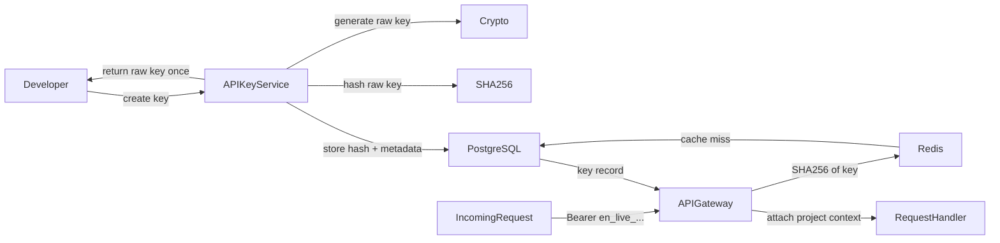

---

## 3.2 PostgreSQL Schema

```sql
CREATE TYPE key_status AS ENUM ('active', 'revoked', 'expired', 'rotated');

CREATE TABLE api_keys (
  id              UUID PRIMARY KEY DEFAULT gen_random_uuid(),
  project_id      UUID NOT NULL REFERENCES projects(id) ON DELETE CASCADE,
  environment     environment_type NOT NULL,
  name            TEXT NOT NULL,
  key_hash        TEXT NOT NULL UNIQUE,
  key_prefix      TEXT NOT NULL,
  scopes          TEXT[] NOT NULL DEFAULT '{}',
  status          key_status NOT NULL DEFAULT 'active',
  last_used_at    TIMESTAMPTZ,
  expires_at      TIMESTAMPTZ,
  rotated_to_id   UUID REFERENCES api_keys(id),
  rate_limit_rpm  INTEGER NOT NULL DEFAULT 60,
  created_by      UUID NOT NULL REFERENCES developer_profiles(id),
  created_at      TIMESTAMPTZ NOT NULL DEFAULT now(),
  updated_at      TIMESTAMPTZ NOT NULL DEFAULT now()
);
CREATE INDEX api_keys_project_id_idx ON api_keys(project_id);
CREATE INDEX api_keys_key_hash_idx ON api_keys(key_hash);
CREATE INDEX api_keys_status_idx ON api_keys(status);
CREATE INDEX api_keys_expires_at_idx ON api_keys(expires_at) WHERE expires_at IS NOT NULL;

CREATE TABLE api_key_usage_events (
  id              UUID PRIMARY KEY DEFAULT gen_random_uuid(),
  api_key_id      UUID NOT NULL REFERENCES api_keys(id),
  project_id      UUID NOT NULL REFERENCES projects(id),
  endpoint        TEXT NOT NULL,
  method          TEXT NOT NULL,
  status_code     INTEGER NOT NULL,
  latency_ms      INTEGER NOT NULL,
  tokens_used     INTEGER NOT NULL DEFAULT 0,
  ip_address      INET,
  created_at      TIMESTAMPTZ NOT NULL DEFAULT now()
);
CREATE INDEX key_usage_api_key_id_idx ON api_key_usage_events(api_key_id);
CREATE INDEX key_usage_project_id_idx ON api_key_usage_events(project_id);
CREATE INDEX key_usage_created_at_idx ON api_key_usage_events(created_at DESC);
```

---

## 3.3 TypeScript Interfaces

```typescript
export type KeyScope =
  | 'ai:generate'
  | 'ai:evaluate'
  | 'ekg:read'
  | 'ekg:write'
  | 'curriculum:read'
  | 'webhooks:manage'
  | 'analytics:read'
  | 'marketplace:publish'
  | 'admin:*';

export type APIKey = {
  id: string;
  projectId: string;
  environment: EnvironmentType;
  name: string;
  keyPrefix: string;
  scopes: KeyScope[];
  status: 'active' | 'revoked' | 'expired' | 'rotated';
  lastUsedAt: string | null;
  expiresAt: string | null;
  rateLimitRpm: number;
  createdBy: string;
  createdAt: string;
};

export type CreateAPIKeyInput = {
  name: string;
  environment: EnvironmentType;
  scopes: KeyScope[];
  expiresAt?: string;
  rateLimitRpm?: number;
};

export type CreateAPIKeyResult = {
  key: APIKey;
  rawKey: string; // returned exactly once, never stored
};

export type APIKeyVerificationResult = {
  valid: boolean;
  key: APIKey | null;
  projectId: string | null;
  scopes: KeyScope[];
};
```

---

## 3.4 Key Generation

```typescript
import { randomBytes, createHash } from 'crypto';
import bs58 from 'bs58';

export function generateAPIKey(environment: EnvironmentType): { raw: string; hash: string; prefix: string } {
  const bytes = randomBytes(32);
  const encoded = bs58.encode(bytes);
  const prefix = environment === 'production' ? 'en_live' : 'en_test';
  const raw = `${prefix}_${encoded}`;
  const hash = createHash('sha256').update(raw).digest('hex');
  const displayPrefix = raw.substring(0, 14); // "en_live_Xyzab"
  return { raw, hash, prefix: displayPrefix };
}

export async function verifyAPIKey(
  raw: string,
  db: SupabaseClient
): Promise<APIKeyVerificationResult> {
  const hash = createHash('sha256').update(raw).digest('hex');

  // Check Redis cache first
  const cached = await redis.get(`apikey:${hash}`);
  if (cached) {
    return JSON.parse(cached);
  }

  const { data: key } = await db
    .from('api_keys')
    .select('id, project_id, environment, scopes, status, expires_at, rate_limit_rpm')
    .eq('key_hash', hash)
    .single();

  if (!key || key.status !== 'active') {
    return { valid: false, key: null, projectId: null, scopes: [] };
  }

  if (key.expires_at && new Date(key.expires_at) < new Date()) {
    await db.from('api_keys').update({ status: 'expired' }).eq('id', key.id);
    return { valid: false, key: null, projectId: null, scopes: [] };
  }

  const result: APIKeyVerificationResult = {
    valid: true,
    key: key as APIKey,
    projectId: key.project_id,
    scopes: key.scopes as KeyScope[],
  };

  // Cache for 60 seconds
  await redis.setex(`apikey:${hash}`, 60, JSON.stringify(result));

  // Async last_used update — fire and forget
  db.from('api_keys').update({ last_used_at: new Date().toISOString() }).eq('id', key.id);

  return result;
}
```

---

## 3.5 Key Rotation

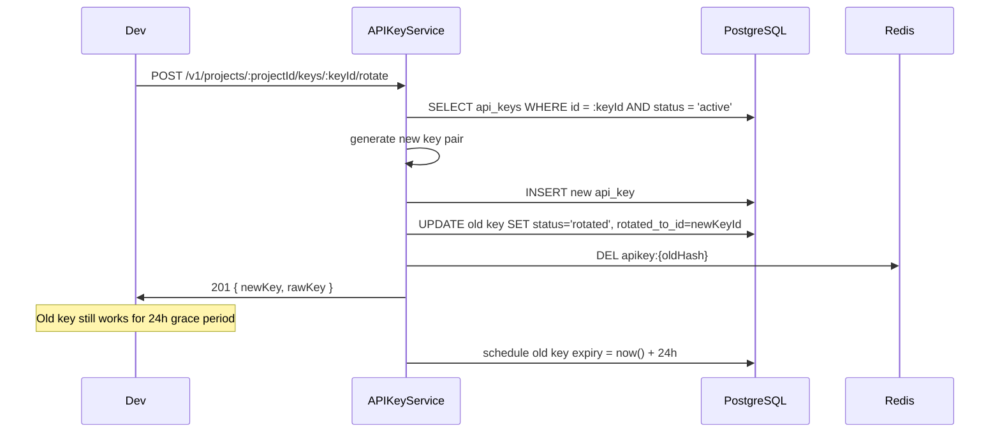

---

## 3.6 REST Endpoints

```
POST   /v1/projects/:projectId/keys          → create API key
GET    /v1/projects/:projectId/keys          → list keys (no raw values)
GET    /v1/projects/:projectId/keys/:keyId   → get key metadata
DELETE /v1/projects/:projectId/keys/:keyId   → revoke key
POST   /v1/projects/:projectId/keys/:keyId/rotate → rotate key

GET    /v1/projects/:projectId/keys/:keyId/usage  → usage stats for key
```

---

## 3.7 Rate Limiting Per Key

Rate limits are enforced in Redis using a sliding window counter:

```typescript
export async function checkKeyRateLimit(
  keyId: string,
  limitRpm: number
): Promise<{ allowed: boolean; remaining: number; resetAt: number }> {
  const now = Date.now();
  const windowStart = now - 60_000;
  const redisKey = `rl:key:${keyId}`;

  const pipeline = redis.pipeline();
  pipeline.zremrangebyscore(redisKey, 0, windowStart);
  pipeline.zadd(redisKey, now, `${now}-${Math.random()}`);
  pipeline.zcard(redisKey);
  pipeline.expire(redisKey, 61);

  const results = await pipeline.exec();
  const count = results[2][1] as number;
  const allowed = count <= limitRpm;
  const resetAt = Math.ceil((now + 60_000) / 1000);

  return { allowed, remaining: Math.max(0, limitRpm - count), resetAt };
}
```

---

## 3.8 Security

- Raw keys never logged, never in database, never in error messages
- Key hash comparison is O(1) constant time — no timing attacks
- Revocation is immediate: cache invalidated synchronously, DB updated
- Scope enforcement: every API handler validates `key.scopes.includes(requiredScope)`
- Key expiry cron runs every 5 minutes to batch-expire timed-out keys

---

## 3.9 Testing Strategy

```typescript
describe('API Key lifecycle', () => {
  it('generates unique keys with correct prefix format', async () => { ... });
  it('returns raw key exactly once on creation', async () => { ... });
  it('verifies valid key within rate limit', async () => { ... });
  it('rejects revoked key immediately after revocation', async () => { ... });
  it('rotates key and maintains 24h grace period for old key', async () => { ... });
  it('enforces rate limit via sliding window', async () => { ... });
  it('rejects expired keys', async () => { ... });
});
```

---

# Part IV — API Gateway

---

## 4.1 Architecture Overview

The API Gateway is the single ingress point for all external developer requests. It runs as a Next.js middleware layer (for the portal) and as a standalone Edge runtime (for direct API calls to `api.edunexus.co.ke`). Its responsibilities: authenticate, authorize, rate-limit, log, route, and enforce quotas — before the request ever reaches a business logic handler.

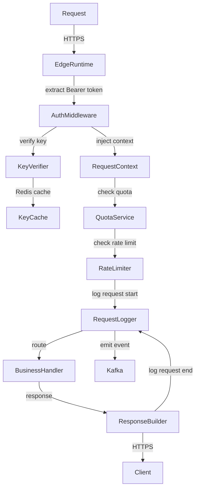

---

## 4.2 Authentication Middleware

```typescript
import { NextRequest, NextResponse } from 'next/server';
import { verifyAPIKey } from '@/lib/api-keys/verify';
import { createServiceClient } from '@/utils/supabase/service';
import { checkKeyRateLimit } from '@/lib/api-keys/rate-limit';
import { emitRequestEvent } from '@/lib/gateway/events';

export type GatewayContext = {
  keyId: string;
  projectId: string;
  environment: EnvironmentType;
  scopes: KeyScope[];
  rateLimitRpm: number;
};

declare module 'next/server' {
  interface NextRequest {
    gatewayContext?: GatewayContext;
  }
}

export async function gatewayMiddleware(
  req: NextRequest,
  requiredScopes: KeyScope[] = []
): Promise<{ context: GatewayContext } | NextResponse> {
  const authHeader = req.headers.get('authorization');
  if (!authHeader?.startsWith('Bearer ')) {
    return errorResponse(401, 'MISSING_AUTH', 'Authorization header required');
  }

  const rawKey = authHeader.slice(7);
  const db = createServiceClient();
  const verification = await verifyAPIKey(rawKey, db);

  if (!verification.valid || !verification.key) {
    return errorResponse(401, 'INVALID_KEY', 'API key is invalid or revoked');
  }

  for (const scope of requiredScopes) {
    if (!verification.scopes.includes(scope) && !verification.scopes.includes('admin:*')) {
      return errorResponse(403, 'INSUFFICIENT_SCOPE', `Required scope: ${scope}`);
    }
  }

  const rateCheck = await checkKeyRateLimit(
    verification.key.id,
    verification.key.rateLimitRpm
  );

  if (!rateCheck.allowed) {
    const response = errorResponse(429, 'RATE_LIMITED', 'Rate limit exceeded');
    response.headers.set('X-RateLimit-Limit', String(verification.key.rateLimitRpm));
    response.headers.set('X-RateLimit-Remaining', '0');
    response.headers.set('X-RateLimit-Reset', String(rateCheck.resetAt));
    return response;
  }

  return {
    context: {
      keyId: verification.key.id,
      projectId: verification.projectId!,
      environment: verification.key.environment,
      scopes: verification.scopes,
      rateLimitRpm: verification.key.rateLimitRpm,
    },
  };
}
```

---

## 4.3 Error Envelope

All API errors follow a consistent envelope:

```typescript
export type APIError = {
  error: {
    code: string;       // machine-readable, e.g. "INVALID_KEY"
    message: string;    // human-readable
    requestId: string;  // trace ID for support
    documentationUrl: string;
  };
};

export type APISuccess<T> = {
  data: T;
  meta?: {
    pagination?: {
      total: number;
      page: number;
      perPage: number;
      hasNext: boolean;
    };
  };
  requestId: string;
};

function errorResponse(
  status: number,
  code: string,
  message: string
): NextResponse {
  const requestId = crypto.randomUUID();
  return NextResponse.json(
    {
      error: {
        code,
        message,
        requestId,
        documentationUrl: `https://developers.edunexus.co.ke/docs/errors#${code.toLowerCase()}`,
      },
    },
    { status, headers: { 'X-Request-ID': requestId } }
  );
}
```

---

## 4.4 Idempotency

Mutating requests accept an `Idempotency-Key` header. The server stores results for 24 hours and replays them on duplicate requests.

```typescript
export async function withIdempotency<T>(
  key: string,
  handler: () => Promise<T>
): Promise<{ result: T; replayed: boolean }> {
  const cached = await redis.get(`idempotency:${key}`);
  if (cached) {
    return { result: JSON.parse(cached), replayed: true };
  }

  const result = await handler();

  await redis.setex(`idempotency:${key}`, 86400, JSON.stringify(result));

  return { result, replayed: false };
}
```

---

## 4.5 Version Negotiation

API version is accepted via header or URL prefix. Supported versions: `v1` (current), `v0` (deprecated, sunset 2027-01-01).

```typescript
export function resolveAPIVersion(req: NextRequest): string {
  const headerVersion = req.headers.get('api-version');
  const urlVersion = req.nextUrl.pathname.match(/^\/v(\d+)\//)?.[1];
  const version = headerVersion ?? (urlVersion ? `v${urlVersion}` : 'v1');

  if (!['v0', 'v1'].includes(version)) {
    throw new APIVersionError(`Unsupported API version: ${version}`);
  }

  return version;
}
```

---

## 4.6 Request Logging

Every request is logged to ClickHouse via Kafka for analytics and audit:

```typescript
export type RequestLogEvent = {
  requestId: string;
  apiKeyId: string;
  projectId: string;
  environment: EnvironmentType;
  method: string;
  path: string;
  statusCode: number;
  latencyMs: number;
  tokensUsed: number;
  ipAddress: string;
  userAgent: string;
  apiVersion: string;
  timestamp: string;
};
```

---

## 4.7 Quota Enforcement

```typescript
export type QuotaResult = {
  allowed: boolean;
  used: number;
  limit: number;
  resetAt: string;
};

export async function checkProjectQuota(
  projectId: string,
  quotaType: 'requests' | 'tokens' | 'ai_calls'
): Promise<QuotaResult> {
  const plan = await getProjectPlan(projectId);
  const limits = PLAN_QUOTAS[plan];
  const monthKey = `quota:${projectId}:${quotaType}:${getCurrentMonth()}`;

  const used = await redis.incrby(monthKey, 1);

  if (used === 1) {
    await redis.expireat(monthKey, getEndOfMonthUnix());
  }

  return {
    allowed: used <= limits[quotaType],
    used,
    limit: limits[quotaType],
    resetAt: getEndOfMonthISO(),
  };
}

const PLAN_QUOTAS: Record<string, Record<string, number>> = {
  free:       { requests: 10_000,  tokens: 100_000,   ai_calls: 500    },
  starter:    { requests: 100_000, tokens: 1_000_000, ai_calls: 5_000  },
  growth:     { requests: 1_000_000, tokens: 10_000_000, ai_calls: 50_000 },
  enterprise: { requests: Infinity, tokens: Infinity,  ai_calls: Infinity },
};
```

---

## 4.8 Retry Semantics

The gateway communicates retry eligibility via response headers:

| Condition | Status | Retry-After |
|-----------|--------|-------------|
| Rate limited | 429 | seconds until window resets |
| Server error | 500 | not set (exponential backoff recommended) |
| Maintenance | 503 | seconds until estimated recovery |
| Quota exceeded | 402 | seconds until month resets |

---

# Part V — AI Gateway

---

## 5.1 Architecture Overview

The AI Gateway wraps every AI call made through the platform. It handles model routing, prompt management, curriculum grounding, streaming, token accounting, safety filtering, and evaluation hooks. No developer calls DeepSeek or any other model provider directly.

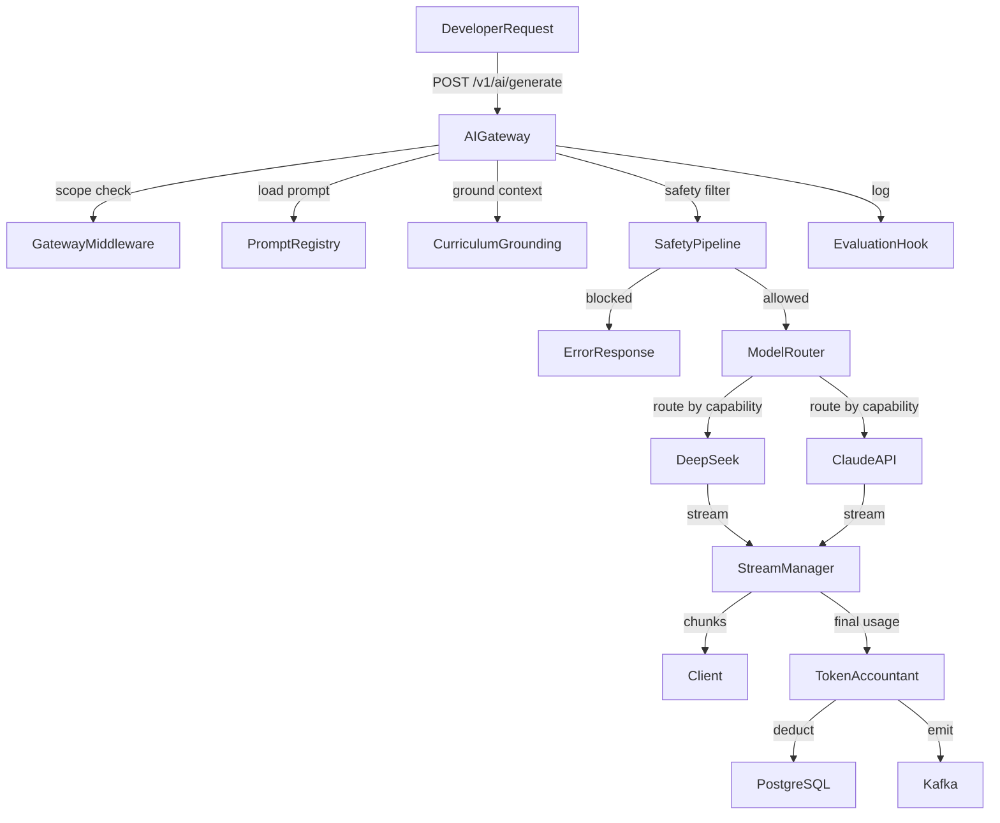

---

## 5.2 PostgreSQL Schema

```sql
CREATE TABLE prompt_registry (
  id              UUID PRIMARY KEY DEFAULT gen_random_uuid(),
  slug            TEXT NOT NULL UNIQUE,
  name            TEXT NOT NULL,
  description     TEXT,
  system_prompt   TEXT NOT NULL,
  user_template   TEXT NOT NULL,
  model_hint      TEXT,
  max_tokens      INTEGER NOT NULL DEFAULT 2000,
  version         INTEGER NOT NULL DEFAULT 1,
  published       BOOLEAN NOT NULL DEFAULT false,
  created_by      UUID NOT NULL REFERENCES developer_profiles(id),
  created_at      TIMESTAMPTZ NOT NULL DEFAULT now(),
  updated_at      TIMESTAMPTZ NOT NULL DEFAULT now()
);
CREATE UNIQUE INDEX prompt_registry_slug_version_idx ON prompt_registry(slug, version);

CREATE TABLE ai_usage_records (
  id              UUID PRIMARY KEY DEFAULT gen_random_uuid(),
  project_id      UUID NOT NULL REFERENCES projects(id),
  api_key_id      UUID NOT NULL REFERENCES api_keys(id),
  model           TEXT NOT NULL,
  prompt_slug     TEXT,
  prompt_tokens   INTEGER NOT NULL,
  completion_tokens INTEGER NOT NULL,
  total_tokens    INTEGER NOT NULL,
  cost_usd        NUMERIC(10, 6) NOT NULL,
  latency_ms      INTEGER NOT NULL,
  cached          BOOLEAN NOT NULL DEFAULT false,
  safety_triggered BOOLEAN NOT NULL DEFAULT false,
  created_at      TIMESTAMPTZ NOT NULL DEFAULT now()
);
CREATE INDEX ai_usage_project_id_idx ON ai_usage_records(project_id);
CREATE INDEX ai_usage_created_at_idx ON ai_usage_records(created_at DESC);

CREATE TABLE ai_evaluation_runs (
  id              UUID PRIMARY KEY DEFAULT gen_random_uuid(),
  usage_record_id UUID NOT NULL REFERENCES ai_usage_records(id),
  evaluator       TEXT NOT NULL,
  score           NUMERIC(4, 3),
  flags           TEXT[] NOT NULL DEFAULT '{}',
  passed          BOOLEAN NOT NULL,
  metadata        JSONB NOT NULL DEFAULT '{}',
  created_at      TIMESTAMPTZ NOT NULL DEFAULT now()
);
```

---

## 5.3 TypeScript Interfaces

```typescript
export type AIModel = 'deepseek-chat' | 'deepseek-reasoner' | 'claude-sonnet-4-6' | 'claude-haiku-4-5-20251001';

export type AIGenerateRequest = {
  model?: AIModel;
  promptSlug?: string;
  systemPrompt?: string;
  messages: Array<{ role: 'user' | 'assistant' | 'system'; content: string }>;
  curriculumContext?: CurriculumContext;
  stream?: boolean;
  maxTokens?: number;
  temperature?: number;
};

export type CurriculumContext = {
  curriculum: 'CBC' | '8-4-4' | 'IGCSE';
  grade?: string;
  subject?: string;
  strand?: string;
  subStrand?: string;
};

export type AIGenerateResponse = {
  id: string;
  model: AIModel;
  content: string;
  usage: {
    promptTokens: number;
    completionTokens: number;
    totalTokens: number;
    costUsd: number;
  };
  cached: boolean;
  latencyMs: number;
};

export type SafetyDecision = {
  allowed: boolean;
  reason: string | null;
  categories: string[];
};
```

---

## 5.4 Model Router

```typescript
const MODEL_CAPABILITIES: Record<string, AIModel> = {
  'reasoning':    'deepseek-reasoner',
  'generation':   'deepseek-chat',
  'evaluation':   'claude-haiku-4-5-20251001',
  'complex':      'claude-sonnet-4-6',
};

export function routeModel(request: AIGenerateRequest): AIModel {
  if (request.model) return request.model;

  const messageCount = request.messages.length;
  const lastMessage = request.messages[messageCount - 1]?.content ?? '';
  const isComplex = lastMessage.length > 2000 || messageCount > 10;

  if (request.promptSlug?.includes('evaluate')) return MODEL_CAPABILITIES['evaluation'];
  if (isComplex) return MODEL_CAPABILITIES['complex'];
  return MODEL_CAPABILITIES['generation'];
}
```

---

## 5.5 Curriculum Grounding

```typescript
export async function groundWithCurriculum(
  messages: AIGenerateRequest['messages'],
  context: CurriculumContext
): Promise<AIGenerateRequest['messages']> {
  const curriculumData = await getCurriculumContext(
    context.curriculum,
    context.grade,
    context.subject,
    context.strand
  );

  const groundingMessage = {
    role: 'system' as const,
    content: `
CURRICULUM CONTEXT:
- Framework: ${context.curriculum}
- Grade: ${context.grade ?? 'unspecified'}
- Subject: ${context.subject ?? 'unspecified'}
- Strand: ${context.strand ?? 'unspecified'}
- Learning Outcomes: ${curriculumData.outcomes.join('; ')}
- Core Competencies: ${curriculumData.competencies.join(', ')}
- Values: ${curriculumData.values.join(', ')}

Ensure all responses align with the Kenya ${context.curriculum} curriculum framework above.
`.trim(),
  };

  return [groundingMessage, ...messages];
}
```

---

## 5.6 Safety Pipeline

```typescript
const BLOCKED_PATTERNS = [
  /exam\s+answers?\s+for\s+20\d\d/i,
  /write\s+my\s+(exam|kcse|kcpe)\s+for\s+me/i,
  /\b(bomb|weapon|explosive)\b/i,
];

export async function runSafetyCheck(
  messages: AIGenerateRequest['messages']
): Promise<SafetyDecision> {
  const combined = messages.map(m => m.content).join('\n');

  for (const pattern of BLOCKED_PATTERNS) {
    if (pattern.test(combined)) {
      return {
        allowed: false,
        reason: 'Content policy violation detected',
        categories: ['academic_integrity'],
      };
    }
  }

  return { allowed: true, reason: null, categories: [] };
}
```

---

## 5.7 Token Accounting

```typescript
export async function recordAIUsage(
  projectId: string,
  apiKeyId: string,
  model: AIModel,
  usage: { promptTokens: number; completionTokens: number },
  latencyMs: number
): Promise<void> {
  const totalTokens = usage.promptTokens + usage.completionTokens;
  const costUsd = calculateCost(model, usage.promptTokens, usage.completionTokens);

  const db = createServiceClient();
  await db.from('ai_usage_records').insert({
    project_id: projectId,
    api_key_id: apiKeyId,
    model,
    prompt_tokens: usage.promptTokens,
    completion_tokens: usage.completionTokens,
    total_tokens: totalTokens,
    cost_usd: costUsd,
    latency_ms: latencyMs,
  });

  // Update Redis monthly counter for quota enforcement
  const monthKey = `quota:${projectId}:tokens:${getCurrentMonth()}`;
  await redis.incrby(monthKey, totalTokens);
}

const TOKEN_COSTS_USD: Record<AIModel, { input: number; output: number }> = {
  'deepseek-chat':           { input: 0.0000001,  output: 0.0000002  },
  'deepseek-reasoner':       { input: 0.00000055, output: 0.00000219 },
  'claude-sonnet-4-6':       { input: 0.000003,   output: 0.000015   },
  'claude-haiku-4-5-20251001': { input: 0.0000008,  output: 0.000004  },
};

function calculateCost(
  model: AIModel,
  promptTokens: number,
  completionTokens: number
): number {
  const costs = TOKEN_COSTS_USD[model];
  return (promptTokens * costs.input) + (completionTokens * costs.output);
}
```

---

## 5.8 Streaming

```typescript
export async function streamAIResponse(
  request: AIGenerateRequest,
  context: GatewayContext,
  res: NextResponse
): Promise<void> {
  const model = routeModel(request);
  const groundedMessages = request.curriculumContext
    ? await groundWithCurriculum(request.messages, request.curriculumContext)
    : request.messages;

  const startTime = Date.now();
  let totalTokens = { promptTokens: 0, completionTokens: 0 };

  const stream = new TransformStream();
  const writer = stream.writable.getWriter();
  const encoder = new TextEncoder();

  const client = getModelClient(model);
  const completion = await client.chat.completions.create({
    model,
    messages: groundedMessages,
    max_tokens: request.maxTokens ?? 2000,
    stream: true,
  });

  (async () => {
    for await (const chunk of completion) {
      const delta = chunk.choices[0]?.delta?.content ?? '';
      if (delta) {
        await writer.write(encoder.encode(`data: ${JSON.stringify({ content: delta })}\n\n`));
      }
      if (chunk.usage) {
        totalTokens = {
          promptTokens: chunk.usage.prompt_tokens,
          completionTokens: chunk.usage.completion_tokens,
        };
      }
    }
    await writer.write(encoder.encode('data: [DONE]\n\n'));
    await writer.close();

    await recordAIUsage(
      context.projectId,
      context.keyId,
      model,
      totalTokens,
      Date.now() - startTime
    );
  })();

  return new NextResponse(stream.readable, {
    headers: {
      'Content-Type': 'text/event-stream',
      'Cache-Control': 'no-cache',
      'Connection': 'keep-alive',
    },
  }) as unknown as void;
}
```

---

## 5.9 REST Endpoints

```
POST   /v1/ai/generate               → non-streaming generation (scope: ai:generate)
POST   /v1/ai/generate/stream        → streaming generation (scope: ai:generate)
POST   /v1/ai/evaluate               → evaluate student response (scope: ai:evaluate)
GET    /v1/ai/prompts                → list available prompt registry entries
GET    /v1/ai/prompts/:slug          → get prompt details
POST   /v1/ai/prompts                → create custom prompt (scope: ai:generate)
GET    /v1/ai/usage                  → AI usage summary for project
```

---

## 5.10 Evaluation Hooks

After every AI response, the evaluation hook runs asynchronously via a background queue:

```typescript
export async function enqueueEvaluation(usageRecordId: string, response: string): Promise<void> {
  await kafka.produce('platform.ai.evaluations', {
    usageRecordId,
    response,
    evaluators: ['coherence', 'curriculum_alignment', 'safety_rescore'],
    enqueuedAt: new Date().toISOString(),
  });
}
```

---

# Part VI — Educational Knowledge Graph Service

---

## 6.1 Architecture Overview

The EKG Service exposes the curriculum knowledge graph to developers via a REST API. The graph is stored in PostgreSQL with materialized relationship tables. Traversals are cached in Redis. The EKG Explorer UI is powered entirely by this service.

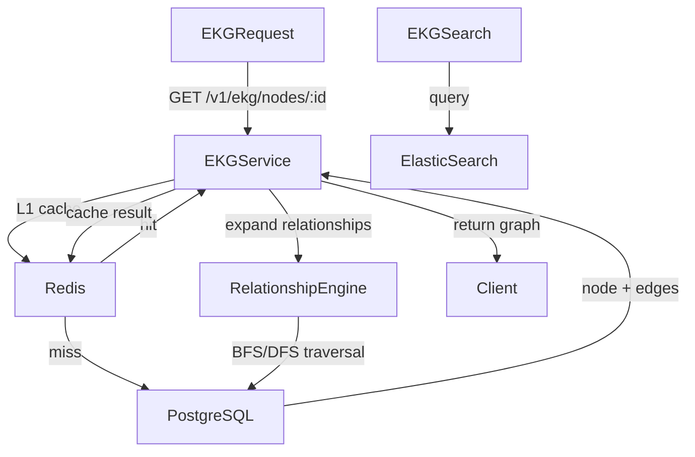

---

## 6.2 PostgreSQL Schema

```sql
CREATE TYPE node_type AS ENUM (
  'curriculum', 'strand', 'sub_strand', 'learning_outcome',
  'core_competency', 'value', 'assessment_rubric',
  'subject', 'grade', 'topic', 'activity'
);

CREATE TABLE ekg_nodes (
  id              UUID PRIMARY KEY DEFAULT gen_random_uuid(),
  external_id     TEXT NOT NULL UNIQUE,
  node_type       node_type NOT NULL,
  label           TEXT NOT NULL,
  description     TEXT,
  curriculum      TEXT NOT NULL CHECK (curriculum IN ('CBC', '8-4-4', 'IGCSE')),
  grade           TEXT,
  subject         TEXT,
  metadata        JSONB NOT NULL DEFAULT '{}',
  version         INTEGER NOT NULL DEFAULT 1,
  published_at    TIMESTAMPTZ,
  created_at      TIMESTAMPTZ NOT NULL DEFAULT now(),
  updated_at      TIMESTAMPTZ NOT NULL DEFAULT now()
);
CREATE INDEX ekg_nodes_curriculum_idx ON ekg_nodes(curriculum);
CREATE INDEX ekg_nodes_node_type_idx ON ekg_nodes(node_type);
CREATE INDEX ekg_nodes_grade_idx ON ekg_nodes(grade) WHERE grade IS NOT NULL;
CREATE INDEX ekg_nodes_external_id_idx ON ekg_nodes(external_id);
CREATE INDEX ekg_nodes_metadata_gin ON ekg_nodes USING gin(metadata);

CREATE TYPE edge_type AS ENUM (
  'has_strand', 'has_sub_strand', 'has_outcome',
  'requires', 'assesses', 'supports_competency',
  'precedes', 'follows', 'cross_references'
);

CREATE TABLE ekg_edges (
  id              UUID PRIMARY KEY DEFAULT gen_random_uuid(),
  source_id       UUID NOT NULL REFERENCES ekg_nodes(id) ON DELETE CASCADE,
  target_id       UUID NOT NULL REFERENCES ekg_nodes(id) ON DELETE CASCADE,
  edge_type       edge_type NOT NULL,
  weight          NUMERIC(4, 3) NOT NULL DEFAULT 1.0,
  metadata        JSONB NOT NULL DEFAULT '{}',
  created_at      TIMESTAMPTZ NOT NULL DEFAULT now(),
  UNIQUE(source_id, target_id, edge_type)
);
CREATE INDEX ekg_edges_source_id_idx ON ekg_edges(source_id);
CREATE INDEX ekg_edges_target_id_idx ON ekg_edges(target_id);
CREATE INDEX ekg_edges_type_idx ON ekg_edges(edge_type);

CREATE TABLE ekg_versions (
  id              UUID PRIMARY KEY DEFAULT gen_random_uuid(),
  version_tag     TEXT NOT NULL UNIQUE,
  changelog       TEXT NOT NULL,
  published_at    TIMESTAMPTZ NOT NULL DEFAULT now(),
  snapshot_url    TEXT
);
```

---

## 6.3 TypeScript Interfaces

```typescript
export type EKGNode = {
  id: string;
  externalId: string;
  nodeType: string;
  label: string;
  description: string | null;
  curriculum: string;
  grade: string | null;
  subject: string | null;
  metadata: Record<string, unknown>;
  version: number;
};

export type EKGEdge = {
  id: string;
  sourceId: string;
  targetId: string;
  edgeType: string;
  weight: number;
};

export type EKGSubgraph = {
  nodes: EKGNode[];
  edges: EKGEdge[];
  rootId: string;
  depth: number;
};

export type EKGSearchResult = {
  node: EKGNode;
  score: number;
  highlights: string[];
};

export type TraversalOptions = {
  depth?: number;          // default: 2, max: 5
  edgeTypes?: string[];    // filter by edge types
  direction?: 'outbound' | 'inbound' | 'both';
  includeMetadata?: boolean;
};
```

---

## 6.4 Graph Traversal

```typescript
export async function traverseGraph(
  rootId: string,
  options: TraversalOptions
): Promise<EKGSubgraph> {
  const depth = Math.min(options.depth ?? 2, 5);
  const cacheKey = `ekg:traverse:${rootId}:${depth}:${options.direction ?? 'outbound'}`;

  const cached = await redis.get(cacheKey);
  if (cached) return JSON.parse(cached);

  const db = createServiceClient();
  const visited = new Set<string>();
  const nodes: EKGNode[] = [];
  const edges: EKGEdge[] = [];
  const queue: Array<{ id: string; currentDepth: number }> = [{ id: rootId, currentDepth: 0 }];

  while (queue.length > 0) {
    const { id, currentDepth } = queue.shift()!;
    if (visited.has(id) || currentDepth > depth) continue;
    visited.add(id);

    const { data: node } = await db
      .from('ekg_nodes')
      .select('id, external_id, node_type, label, description, curriculum, grade, subject, metadata, version')
      .eq('id', id)
      .single();

    if (!node) continue;
    nodes.push(mapNode(node));

    const edgeQuery = db
      .from('ekg_edges')
      .select('id, source_id, target_id, edge_type, weight');

    if (options.direction !== 'inbound') {
      edgeQuery.eq('source_id', id);
    }

    if (options.edgeTypes?.length) {
      edgeQuery.in('edge_type', options.edgeTypes);
    }

    const { data: nodeEdges } = await edgeQuery;
    for (const edge of nodeEdges ?? []) {
      edges.push(mapEdge(edge));
      const nextId = edge.source_id === id ? edge.target_id : edge.source_id;
      if (!visited.has(nextId)) {
        queue.push({ id: nextId, currentDepth: currentDepth + 1 });
      }
    }
  }

  const result: EKGSubgraph = { nodes, edges, rootId, depth };
  await redis.setex(cacheKey, 3600, JSON.stringify(result)); // 1 hour cache
  return result;
}
```

---

## 6.5 REST Endpoints

```
GET    /v1/ekg/nodes                         → list nodes (paginated, filtered)
GET    /v1/ekg/nodes/:id                     → get node by ID
GET    /v1/ekg/nodes/:id/expand              → expand node subgraph
GET    /v1/ekg/nodes/:id/relationships       → list direct relationships
POST   /v1/ekg/search                        → full-text search across nodes
GET    /v1/ekg/path?from=:id&to=:id          → shortest path between two nodes
GET    /v1/ekg/curriculum/:code              → get full curriculum tree
GET    /v1/ekg/versions                      → list graph versions
GET    /v1/ekg/versions/:tag                 → get specific version metadata
```

---

## 6.6 Cache Strategy

| Operation | Cache Key | TTL |
|-----------|-----------|-----|
| Node fetch | `ekg:node:{id}` | 1 hour |
| Subgraph traversal | `ekg:traverse:{rootId}:{depth}:{dir}` | 1 hour |
| Curriculum tree | `ekg:curriculum:{code}` | 24 hours |
| Search results | `ekg:search:{queryHash}` | 15 minutes |

Cache is invalidated via `ekg.graph.updated` Kafka event when nodes or edges are modified.

---

## 6.7 Versioning

The EKG is versioned. Each version represents a KICD curriculum update. The API supports requesting a specific version: `GET /v1/ekg/nodes?version=2025.1`. Without a version parameter, the latest published version is returned.

---

# Part VII — Marketplace Backend

---

## 7.1 Architecture Overview

The marketplace allows publishers to list plugins, curriculum packs, and AI prompt templates. It handles listings, reviews, revenue splits, publisher certification, download tracking, and the full purchase lifecycle.

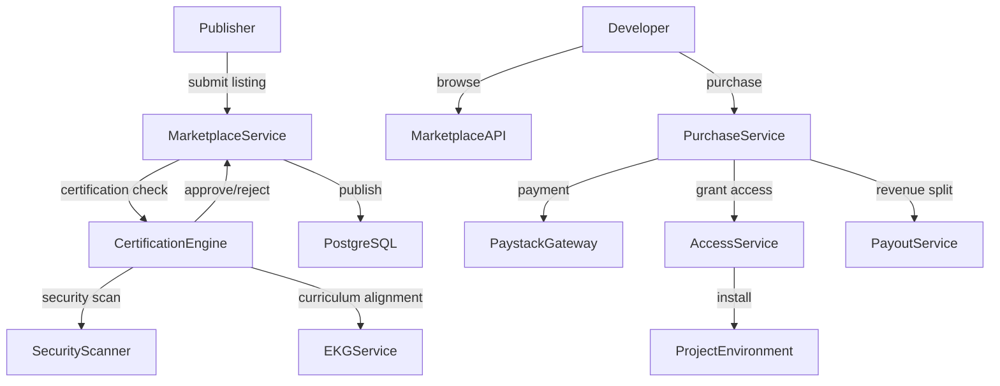

---

## 7.2 PostgreSQL Schema

```sql
CREATE TYPE listing_type AS ENUM ('plugin', 'curriculum_pack', 'prompt_template', 'data_connector');
CREATE TYPE listing_status AS ENUM ('draft', 'pending_review', 'approved', 'rejected', 'suspended', 'archived');
CREATE TYPE pricing_model AS ENUM ('free', 'one_time', 'subscription', 'usage_based');

CREATE TABLE marketplace_publishers (
  id              UUID PRIMARY KEY DEFAULT gen_random_uuid(),
  developer_id    UUID REFERENCES developer_profiles(id),
  organization_id UUID REFERENCES organizations(id),
  display_name    TEXT NOT NULL,
  bio             TEXT,
  website_url     TEXT,
  verified        BOOLEAN NOT NULL DEFAULT false,
  certified       BOOLEAN NOT NULL DEFAULT false,
  payout_account  TEXT,
  revenue_share   NUMERIC(4, 3) NOT NULL DEFAULT 0.70,
  created_at      TIMESTAMPTZ NOT NULL DEFAULT now(),
  updated_at      TIMESTAMPTZ NOT NULL DEFAULT now()
);

CREATE TABLE marketplace_listings (
  id              UUID PRIMARY KEY DEFAULT gen_random_uuid(),
  publisher_id    UUID NOT NULL REFERENCES marketplace_publishers(id),
  listing_type    listing_type NOT NULL,
  name            TEXT NOT NULL,
  slug            TEXT NOT NULL UNIQUE,
  tagline         TEXT NOT NULL,
  description_mdx TEXT NOT NULL,
  icon_url        TEXT,
  screenshots     TEXT[] NOT NULL DEFAULT '{}',
  tags            TEXT[] NOT NULL DEFAULT '{}',
  version         TEXT NOT NULL DEFAULT '1.0.0',
  pricing_model   pricing_model NOT NULL DEFAULT 'free',
  price_kes       INTEGER,
  status          listing_status NOT NULL DEFAULT 'draft',
  certified       BOOLEAN NOT NULL DEFAULT false,
  install_count   INTEGER NOT NULL DEFAULT 0,
  avg_rating      NUMERIC(3, 2),
  review_count    INTEGER NOT NULL DEFAULT 0,
  artifact_url    TEXT,
  manifest        JSONB NOT NULL DEFAULT '{}',
  created_at      TIMESTAMPTZ NOT NULL DEFAULT now(),
  updated_at      TIMESTAMPTZ NOT NULL DEFAULT now()
);
CREATE INDEX listings_publisher_id_idx ON marketplace_listings(publisher_id);
CREATE INDEX listings_status_idx ON marketplace_listings(status);
CREATE INDEX listings_type_idx ON marketplace_listings(listing_type);
CREATE INDEX listings_tags_gin ON marketplace_listings USING gin(tags);

CREATE TABLE marketplace_reviews (
  id              UUID PRIMARY KEY DEFAULT gen_random_uuid(),
  listing_id      UUID NOT NULL REFERENCES marketplace_listings(id) ON DELETE CASCADE,
  reviewer_id     UUID NOT NULL REFERENCES developer_profiles(id),
  rating          INTEGER NOT NULL CHECK (rating BETWEEN 1 AND 5),
  title           TEXT NOT NULL,
  body            TEXT NOT NULL,
  verified_install BOOLEAN NOT NULL DEFAULT false,
  created_at      TIMESTAMPTZ NOT NULL DEFAULT now(),
  updated_at      TIMESTAMPTZ NOT NULL DEFAULT now(),
  UNIQUE(listing_id, reviewer_id)
);
CREATE INDEX reviews_listing_id_idx ON marketplace_reviews(listing_id);

CREATE TABLE marketplace_purchases (
  id              UUID PRIMARY KEY DEFAULT gen_random_uuid(),
  listing_id      UUID NOT NULL REFERENCES marketplace_listings(id),
  buyer_id        UUID NOT NULL REFERENCES developer_profiles(id),
  project_id      UUID NOT NULL REFERENCES projects(id),
  amount_kes      INTEGER NOT NULL,
  paystack_ref    TEXT UNIQUE,
  status          TEXT NOT NULL DEFAULT 'pending' CHECK (status IN ('pending', 'completed', 'refunded')),
  publisher_payout INTEGER,
  created_at      TIMESTAMPTZ NOT NULL DEFAULT now(),
  updated_at      TIMESTAMPTZ NOT NULL DEFAULT now()
);
CREATE INDEX purchases_listing_id_idx ON marketplace_purchases(listing_id);
CREATE INDEX purchases_buyer_id_idx ON marketplace_purchases(buyer_id);

CREATE TABLE marketplace_installs (
  id              UUID PRIMARY KEY DEFAULT gen_random_uuid(),
  listing_id      UUID NOT NULL REFERENCES marketplace_listings(id),
  project_id      UUID NOT NULL REFERENCES projects(id),
  installed_by    UUID NOT NULL REFERENCES developer_profiles(id),
  version         TEXT NOT NULL,
  active          BOOLEAN NOT NULL DEFAULT true,
  created_at      TIMESTAMPTZ NOT NULL DEFAULT now(),
  updated_at      TIMESTAMPTZ NOT NULL DEFAULT now(),
  UNIQUE(listing_id, project_id)
);
```

---

## 7.3 TypeScript Interfaces

```typescript
export type MarketplaceListing = {
  id: string;
  publisherId: string;
  listingType: 'plugin' | 'curriculum_pack' | 'prompt_template' | 'data_connector';
  name: string;
  slug: string;
  tagline: string;
  version: string;
  pricingModel: 'free' | 'one_time' | 'subscription' | 'usage_based';
  priceKes: number | null;
  status: string;
  certified: boolean;
  installCount: number;
  avgRating: number | null;
  tags: string[];
  manifest: ListingManifest;
};

export type ListingManifest = {
  permissions: string[];
  hooks: string[];
  apiVersion: string;
  minPlanRequired: string;
};

export type PurchaseListingInput = {
  listingId: string;
  projectId: string;
  paystackRef: string;
};
```

---

## 7.4 Certification Engine

```typescript
export type CertificationResult = {
  passed: boolean;
  score: number;
  checks: CertificationCheck[];
};

export type CertificationCheck = {
  name: string;
  passed: boolean;
  message: string;
};

export async function runCertification(
  listingId: string
): Promise<CertificationResult> {
  const listing = await getListing(listingId);
  const checks: CertificationCheck[] = [];

  // Security: no dangerous permissions requested
  const dangerousPermissions = ['admin:*', 'system:execute'];
  const securityPassed = !listing.manifest.permissions.some(p =>
    dangerousPermissions.includes(p)
  );
  checks.push({ name: 'permission_safety', passed: securityPassed, message: securityPassed ? 'OK' : 'Dangerous permissions requested' });

  // Curriculum: validates curriculum alignment if pack type
  if (listing.listingType === 'curriculum_pack') {
    const aligned = await checkCurriculumAlignment(listing);
    checks.push({ name: 'curriculum_alignment', passed: aligned, message: aligned ? 'Aligned' : 'Failed curriculum alignment check' });
  }

  // API version: ensures compatibility
  const apiCompatible = ['v1'].includes(listing.manifest.apiVersion);
  checks.push({ name: 'api_compatibility', passed: apiCompatible, message: apiCompatible ? 'Compatible' : 'Unsupported API version' });

  const passed = checks.every(c => c.passed);
  const score = checks.filter(c => c.passed).length / checks.length;

  return { passed, score, checks };
}
```

---

## 7.5 REST Endpoints

```
GET    /v1/marketplace/listings              → list published listings (public)
GET    /v1/marketplace/listings/:slug        → get listing detail (public)
GET    /v1/marketplace/listings/:slug/reviews → list reviews (public)

POST   /v1/marketplace/listings              → create listing (publisher, scope: marketplace:publish)
PATCH  /v1/marketplace/listings/:id          → update listing
POST   /v1/marketplace/listings/:id/submit   → submit for review
POST   /v1/marketplace/listings/:id/certify  → trigger certification (admin)

POST   /v1/marketplace/reviews               → post review (verified install only)

POST   /v1/marketplace/purchases             → initiate purchase
POST   /v1/marketplace/purchases/webhook     → Paystack payment confirmation

POST   /v1/marketplace/installs              → install free listing to project
DELETE /v1/marketplace/installs/:id          → uninstall
GET    /v1/marketplace/installs              → list project installs
```

---

# Part VIII — Webhooks

---

## 8.1 Architecture Overview

The webhook system delivers platform events to developer endpoints. It handles signing, delivery, retry scheduling, dead-letter queuing, replay, and ordering guarantees per topic.

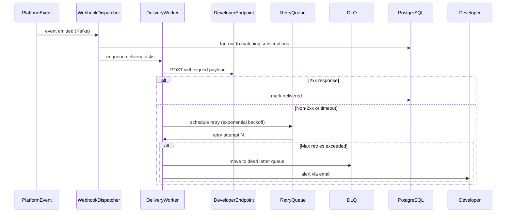

---

## 8.2 PostgreSQL Schema

```sql
CREATE TABLE webhook_subscriptions (
  id              UUID PRIMARY KEY DEFAULT gen_random_uuid(),
  project_id      UUID NOT NULL REFERENCES projects(id) ON DELETE CASCADE,
  endpoint_url    TEXT NOT NULL,
  secret          TEXT NOT NULL,
  events          TEXT[] NOT NULL DEFAULT '{}',
  active          BOOLEAN NOT NULL DEFAULT true,
  description     TEXT,
  created_at      TIMESTAMPTZ NOT NULL DEFAULT now(),
  updated_at      TIMESTAMPTZ NOT NULL DEFAULT now()
);
CREATE INDEX webhook_subs_project_id_idx ON webhook_subscriptions(project_id);
CREATE INDEX webhook_subs_events_gin ON webhook_subscriptions USING gin(events);

CREATE TYPE delivery_status AS ENUM ('pending', 'delivered', 'failed', 'dead');

CREATE TABLE webhook_deliveries (
  id              UUID PRIMARY KEY DEFAULT gen_random_uuid(),
  subscription_id UUID NOT NULL REFERENCES webhook_subscriptions(id) ON DELETE CASCADE,
  event_type      TEXT NOT NULL,
  event_id        TEXT NOT NULL,
  payload         JSONB NOT NULL,
  status          delivery_status NOT NULL DEFAULT 'pending',
  attempts        INTEGER NOT NULL DEFAULT 0,
  last_attempt_at TIMESTAMPTZ,
  next_retry_at   TIMESTAMPTZ,
  response_status INTEGER,
  response_body   TEXT,
  duration_ms     INTEGER,
  created_at      TIMESTAMPTZ NOT NULL DEFAULT now(),
  updated_at      TIMESTAMPTZ NOT NULL DEFAULT now()
);
CREATE INDEX deliveries_subscription_id_idx ON webhook_deliveries(subscription_id);
CREATE INDEX deliveries_status_idx ON webhook_deliveries(status);
CREATE INDEX deliveries_next_retry_idx ON webhook_deliveries(next_retry_at) WHERE status = 'pending';
```

---

## 8.3 Signing

Every delivery is signed using HMAC-SHA256 with the subscription secret:

```typescript
import { createHmac, timingSafeEqual } from 'crypto';

export function signWebhookPayload(payload: string, secret: string): string {
  const timestamp = Math.floor(Date.now() / 1000);
  const signed = `${timestamp}.${payload}`;
  const signature = createHmac('sha256', secret).update(signed).digest('hex');
  return `t=${timestamp},v1=${signature}`;
}

export function verifyWebhookSignature(
  payload: string,
  signatureHeader: string,
  secret: string,
  toleranceSeconds = 300
): boolean {
  const parts = Object.fromEntries(signatureHeader.split(',').map(p => p.split('=')));
  const timestamp = parseInt(parts['t'], 10);
  const providedSig = parts['v1'];

  if (Math.abs(Date.now() / 1000 - timestamp) > toleranceSeconds) return false;

  const signed = `${timestamp}.${payload}`;
  const expected = createHmac('sha256', secret).update(signed).digest('hex');
  const expectedBuf = Buffer.from(expected, 'hex');
  const providedBuf = Buffer.from(providedSig, 'hex');

  if (expectedBuf.length !== providedBuf.length) return false;
  return timingSafeEqual(expectedBuf, providedBuf);
}
```

---

## 8.4 Retry Schedule

| Attempt | Delay |
|---------|-------|
| 1 | 1 minute |
| 2 | 5 minutes |
| 3 | 30 minutes |
| 4 | 2 hours |
| 5 | 8 hours |
| 6 | 24 hours |
| Dead | moved to DLQ |

---

## 8.5 Delivery Worker

```typescript
export async function processWebhookDelivery(deliveryId: string): Promise<void> {
  const db = createServiceClient();
  const { data: delivery } = await db
    .from('webhook_deliveries')
    .select('id, subscription_id, payload, attempts, event_type')
    .eq('id', deliveryId)
    .single();

  const { data: sub } = await db
    .from('webhook_subscriptions')
    .select('endpoint_url, secret')
    .eq('id', delivery.subscription_id)
    .single();

  const payload = JSON.stringify(delivery.payload);
  const signature = signWebhookPayload(payload, sub.secret);
  const start = Date.now();

  try {
    const response = await fetch(sub.endpoint_url, {
      method: 'POST',
      headers: {
        'Content-Type': 'application/json',
        'X-EduNexus-Signature': signature,
        'X-EduNexus-Event': delivery.event_type,
        'X-EduNexus-Delivery': deliveryId,
      },
      body: payload,
      signal: AbortSignal.timeout(30_000),
    });

    const durationMs = Date.now() - start;
    const success = response.status >= 200 && response.status < 300;

    await db.from('webhook_deliveries').update({
      status: success ? 'delivered' : 'failed',
      attempts: delivery.attempts + 1,
      last_attempt_at: new Date().toISOString(),
      next_retry_at: success ? null : computeNextRetry(delivery.attempts + 1),
      response_status: response.status,
      duration_ms: durationMs,
    }).eq('id', deliveryId);

  } catch (err) {
    const attempts = delivery.attempts + 1;
    await db.from('webhook_deliveries').update({
      status: attempts >= 6 ? 'dead' : 'failed',
      attempts,
      last_attempt_at: new Date().toISOString(),
      next_retry_at: attempts >= 6 ? null : computeNextRetry(attempts),
    }).eq('id', deliveryId);
  }
}
```

---

## 8.6 REST Endpoints

```
POST   /v1/webhooks                          → create subscription
GET    /v1/webhooks                          → list subscriptions
GET    /v1/webhooks/:id                      → get subscription
PATCH  /v1/webhooks/:id                      → update subscription
DELETE /v1/webhooks/:id                      → delete subscription
POST   /v1/webhooks/:id/test                 → send test event

GET    /v1/webhooks/:id/deliveries           → list deliveries
GET    /v1/webhooks/:id/deliveries/:delivId  → get delivery detail
POST   /v1/webhooks/:id/deliveries/:delivId/replay → replay failed delivery
```

---

## 8.7 Available Event Types

```typescript
export const WEBHOOK_EVENTS = [
  'project.created',
  'project.updated',
  'project.suspended',
  'api_key.created',
  'api_key.revoked',
  'ai.generation.completed',
  'ai.quota.warning',        // at 80% of monthly quota
  'ai.quota.exceeded',
  'marketplace.install.created',
  'marketplace.purchase.completed',
  'billing.invoice.created',
  'billing.payment.failed',
  'ekg.graph.updated',
] as const;
```

---

# Part IX — Billing

---

## 9.1 Architecture Overview

Billing tracks usage metering, manages subscription plans, enforces quotas, generates invoices, and processes payments via Paystack. Every billable operation flows through the metering pipeline before money changes hands.

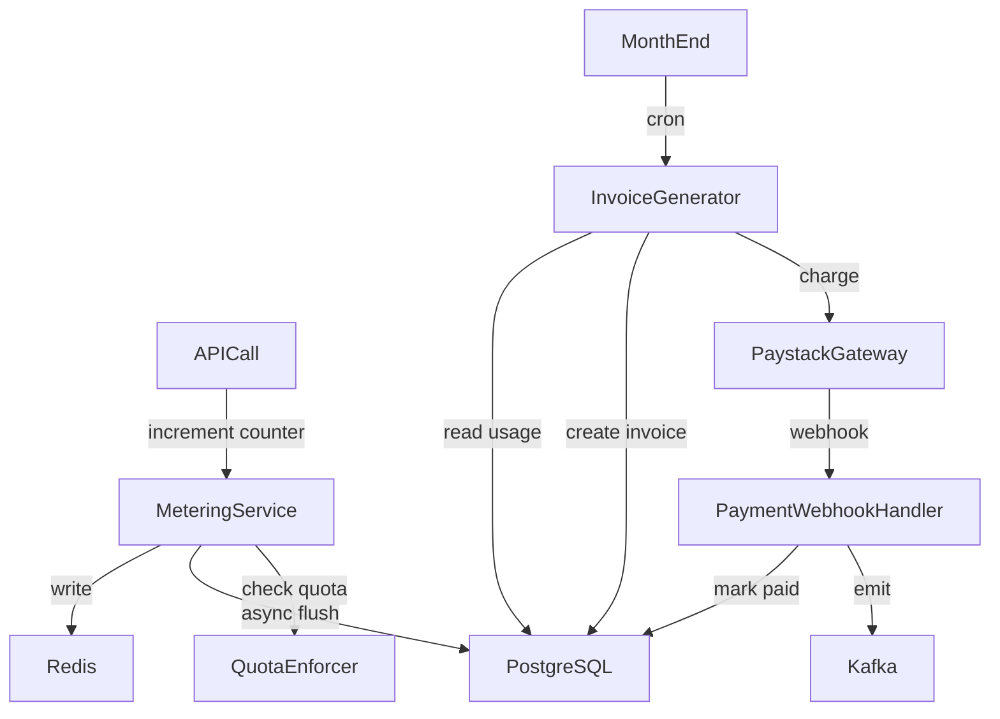

---

## 9.2 PostgreSQL Schema

```sql
CREATE TYPE billing_plan AS ENUM ('free', 'starter', 'growth', 'enterprise');
CREATE TYPE invoice_status AS ENUM ('draft', 'open', 'paid', 'void', 'uncollectible');

CREATE TABLE billing_subscriptions (
  id              UUID PRIMARY KEY DEFAULT gen_random_uuid(),
  project_id      UUID NOT NULL UNIQUE REFERENCES projects(id) ON DELETE CASCADE,
  plan            billing_plan NOT NULL DEFAULT 'free',
  current_period_start TIMESTAMPTZ NOT NULL DEFAULT date_trunc('month', now()),
  current_period_end   TIMESTAMPTZ NOT NULL DEFAULT (date_trunc('month', now()) + INTERVAL '1 month'),
  trial_ends_at   TIMESTAMPTZ,
  cancelled_at    TIMESTAMPTZ,
  paystack_sub_code TEXT UNIQUE,
  created_at      TIMESTAMPTZ NOT NULL DEFAULT now(),
  updated_at      TIMESTAMPTZ NOT NULL DEFAULT now()
);
CREATE INDEX billing_subs_project_id_idx ON billing_subscriptions(project_id);

CREATE TABLE usage_records (
  id              UUID PRIMARY KEY DEFAULT gen_random_uuid(),
  project_id      UUID NOT NULL REFERENCES projects(id),
  period_start    TIMESTAMPTZ NOT NULL,
  period_end      TIMESTAMPTZ NOT NULL,
  api_requests    BIGINT NOT NULL DEFAULT 0,
  ai_calls        BIGINT NOT NULL DEFAULT 0,
  tokens_used     BIGINT NOT NULL DEFAULT 0,
  storage_gb      NUMERIC(10, 4) NOT NULL DEFAULT 0,
  created_at      TIMESTAMPTZ NOT NULL DEFAULT now(),
  updated_at      TIMESTAMPTZ NOT NULL DEFAULT now(),
  UNIQUE(project_id, period_start)
);
CREATE INDEX usage_records_project_id_idx ON usage_records(project_id);
CREATE INDEX usage_records_period_start_idx ON usage_records(period_start);

CREATE TABLE invoices (
  id              UUID PRIMARY KEY DEFAULT gen_random_uuid(),
  project_id      UUID NOT NULL REFERENCES projects(id),
  subscription_id UUID NOT NULL REFERENCES billing_subscriptions(id),
  status          invoice_status NOT NULL DEFAULT 'draft',
  period_start    TIMESTAMPTZ NOT NULL,
  period_end      TIMESTAMPTZ NOT NULL,
  subtotal_kes    INTEGER NOT NULL DEFAULT 0,
  tax_kes         INTEGER NOT NULL DEFAULT 0,
  total_kes       INTEGER NOT NULL DEFAULT 0,
  paid_at         TIMESTAMPTZ,
  paystack_ref    TEXT UNIQUE,
  line_items      JSONB NOT NULL DEFAULT '[]',
  created_at      TIMESTAMPTZ NOT NULL DEFAULT now(),
  updated_at      TIMESTAMPTZ NOT NULL DEFAULT now()
);
CREATE INDEX invoices_project_id_idx ON invoices(project_id);
CREATE INDEX invoices_status_idx ON invoices(status);

CREATE TABLE plan_prices (
  id              UUID PRIMARY KEY DEFAULT gen_random_uuid(),
  plan            billing_plan NOT NULL UNIQUE,
  base_price_kes  INTEGER NOT NULL,
  included_requests BIGINT NOT NULL,
  included_tokens   BIGINT NOT NULL,
  overage_per_1k_requests_kes INTEGER NOT NULL DEFAULT 0,
  overage_per_1k_tokens_kes   INTEGER NOT NULL DEFAULT 0,
  created_at      TIMESTAMPTZ NOT NULL DEFAULT now()
);
```

---

## 9.3 Metering Service

```typescript
const FLUSH_INTERVAL_MS = 60_000;
const BATCH_SIZE = 1000;

export class MeteringService {
  async recordAPIRequest(projectId: string, tokensUsed: number = 0): Promise<void> {
    const month = getCurrentMonthKey();
    const pipe = redis.pipeline();
    pipe.hincrby(`meter:${projectId}:${month}`, 'api_requests', 1);
    if (tokensUsed > 0) {
      pipe.hincrby(`meter:${projectId}:${month}`, 'tokens_used', tokensUsed);
    }
    pipe.expire(`meter:${projectId}:${month}`, 35 * 24 * 3600);
    await pipe.exec();
  }

  async flushToDatabase(): Promise<void> {
    const keys = await redis.keys('meter:*');
    const db = createServiceClient();

    for (const key of keys) {
      const [, projectId, month] = key.split(':');
      const data = await redis.hgetall(key);
      if (!data) continue;

      const periodStart = parseMonthKey(month);
      const periodEnd = endOfMonth(periodStart);

      await db.from('usage_records').upsert({
        project_id: projectId,
        period_start: periodStart.toISOString(),
        period_end: periodEnd.toISOString(),
        api_requests: parseInt(data['api_requests'] ?? '0'),
        ai_calls: parseInt(data['ai_calls'] ?? '0'),
        tokens_used: parseInt(data['tokens_used'] ?? '0'),
      }, { onConflict: 'project_id,period_start' });
    }
  }
}
```

---

## 9.4 Paystack Integration

```typescript
export async function initiateSubscriptionCharge(
  projectId: string,
  plan: BillingPlan,
  email: string
): Promise<{ authorizationUrl: string; reference: string }> {
  const prices = await getPlanPrices(plan);
  const reference = `sub_${projectId}_${Date.now()}`;

  const response = await fetch('https://api.paystack.co/transaction/initialize', {
    method: 'POST',
    headers: {
      Authorization: `Bearer ${process.env.PAYSTACK_SECRET_KEY}`,
      'Content-Type': 'application/json',
    },
    body: JSON.stringify({
      email,
      amount: prices.basePriceKes * 100, // Paystack uses kobo
      reference,
      metadata: { projectId, plan },
      callback_url: `${process.env.APP_URL}/api/billing/paystack-callback`,
    }),
  });

  const data = await response.json();
  if (!data.status) throw new Error(`Paystack initialization failed: ${data.message}`);

  return {
    authorizationUrl: data.data.authorization_url,
    reference,
  };
}

export async function handlePaystackWebhook(
  payload: string,
  signature: string
): Promise<void> {
  const expectedSig = createHmac('sha512', process.env.PAYSTACK_WEBHOOK_SECRET!)
    .update(payload)
    .digest('hex');

  if (!timingSafeEqual(Buffer.from(expectedSig), Buffer.from(signature))) {
    throw new Error('Invalid Paystack webhook signature');
  }

  const event = JSON.parse(payload);
  if (event.event !== 'charge.success') return;

  const { projectId, plan } = event.data.metadata;
  const db = createServiceClient();

  // Idempotency: check for existing record
  const { data: existing } = await db
    .from('invoices')
    .select('id')
    .eq('paystack_ref', event.data.reference)
    .single();

  if (existing) return;

  await db.from('invoices').update({
    status: 'paid',
    paid_at: new Date().toISOString(),
    paystack_ref: event.data.reference,
  }).eq('project_id', projectId).eq('status', 'open');

  await db.from('billing_subscriptions').update({ plan }).eq('project_id', projectId);
}
```

---

## 9.5 REST Endpoints

```
GET    /v1/billing/subscription              → get project subscription
POST   /v1/billing/subscription/upgrade      → initiate plan upgrade
POST   /v1/billing/subscription/cancel       → cancel subscription

GET    /v1/billing/invoices                  → list invoices
GET    /v1/billing/invoices/:id              → get invoice detail

GET    /v1/billing/usage                     → current period usage
GET    /v1/billing/usage/history             → historical usage by period

POST   /v1/billing/paystack/webhook          → Paystack payment webhook (unsigned public endpoint — verify signature internally)
```

---

# Part X — Analytics

---

## 10.1 Architecture Overview

All analytics data flows to ClickHouse via Kafka. The API surfaces aggregated metrics to developers for their own usage. Platform-wide analytics feed internal dashboards.

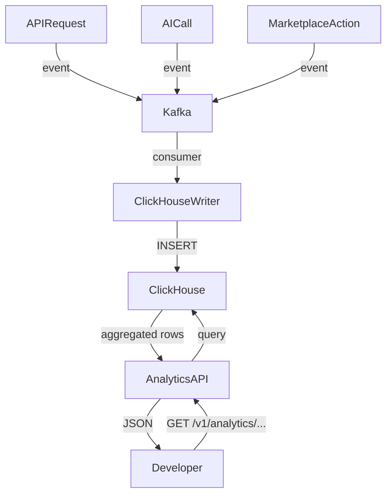

---

## 10.2 ClickHouse Schema

```sql
-- Request events table
CREATE TABLE api_requests (
  request_id      UUID,
  api_key_id      UUID,
  project_id      UUID,
  environment     LowCardinality(String),
  method          LowCardinality(String),
  path            String,
  status_code     UInt16,
  latency_ms      UInt32,
  tokens_used     UInt32,
  ip_address      IPv4,
  api_version     LowCardinality(String),
  timestamp       DateTime64(3, 'UTC')
) ENGINE = MergeTree()
PARTITION BY toYYYYMM(timestamp)
ORDER BY (project_id, timestamp)
TTL timestamp + INTERVAL 90 DAY;

-- AI usage table
CREATE TABLE ai_usage (
  usage_id        UUID,
  project_id      UUID,
  api_key_id      UUID,
  model           LowCardinality(String),
  prompt_slug     String,
  prompt_tokens   UInt32,
  completion_tokens UInt32,
  cost_usd        Float32,
  latency_ms      UInt32,
  cached          UInt8,
  safety_triggered UInt8,
  timestamp       DateTime64(3, 'UTC')
) ENGINE = MergeTree()
PARTITION BY toYYYYMM(timestamp)
ORDER BY (project_id, timestamp)
TTL timestamp + INTERVAL 90 DAY;

-- SDK download events
CREATE TABLE sdk_downloads (
  sdk_name        LowCardinality(String),
  sdk_version     String,
  package_manager LowCardinality(String),
  country_code    LowCardinality(String),
  timestamp       DateTime64(3, 'UTC')
) ENGINE = MergeTree()
PARTITION BY toYYYYMM(timestamp)
ORDER BY (sdk_name, timestamp);
```

---

## 10.3 TypeScript Interfaces

```typescript
export type RequestMetrics = {
  totalRequests: number;
  successRate: number;
  p50LatencyMs: number;
  p95LatencyMs: number;
  p99LatencyMs: number;
  errorRate: number;
  topEndpoints: Array<{ path: string; count: number; avgLatencyMs: number }>;
};

export type AIUsageMetrics = {
  totalCalls: number;
  totalTokens: number;
  totalCostUsd: number;
  cacheHitRate: number;
  safetyTriggerRate: number;
  byModel: Array<{ model: string; calls: number; tokens: number; costUsd: number }>;
};

export type AnalyticsQuery = {
  projectId: string;
  from: string;   // ISO timestamp
  to: string;     // ISO timestamp
  granularity: 'hour' | 'day' | 'week' | 'month';
};
```

---

## 10.4 Analytics Service

```typescript
export async function getRequestMetrics(query: AnalyticsQuery): Promise<RequestMetrics> {
  const result = await clickhouse.query({
    query: `
      SELECT
        count() AS total_requests,
        countIf(status_code >= 200 AND status_code < 300) / count() AS success_rate,
        quantile(0.50)(latency_ms) AS p50,
        quantile(0.95)(latency_ms) AS p95,
        quantile(0.99)(latency_ms) AS p99,
        countIf(status_code >= 500) / count() AS error_rate
      FROM api_requests
      WHERE project_id = {projectId: UUID}
        AND timestamp >= {from: DateTime}
        AND timestamp <= {to: DateTime}
    `,
    query_params: query,
    format: 'JSONEachRow',
  });

  const rows = await result.json();
  return mapToRequestMetrics(rows[0]);
}
```

---

## 10.5 REST Endpoints

```
GET    /v1/analytics/requests                → request volume and latency metrics
GET    /v1/analytics/errors                  → error breakdown by type and endpoint
GET    /v1/analytics/ai                      → AI usage metrics
GET    /v1/analytics/ai/models               → usage by model
GET    /v1/analytics/keys/:keyId             → per-key metrics
GET    /v1/analytics/adoption                → daily active usage, retention
```

---

# Part XI — Infrastructure

---

## 11.1 Architecture Overview

The platform runs on a multi-tier infrastructure designed for the East Africa market (primary region: `af-south-1` on AWS, with Supabase project in `ap-southeast-1` as nearest available). Every component is provisioned for zero-downtime deploys.

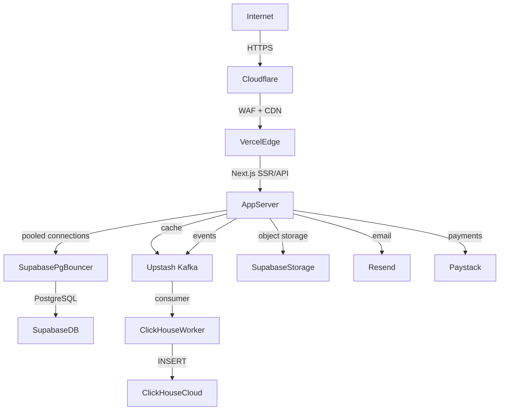

---

## 11.2 Redis Topology

**Provider:** Upstash Redis (serverless, per-request billing)

| Key Namespace | Purpose | TTL |
|---------------|---------|-----|
| `apikey:{hash}` | API key verification cache | 60s |
| `rl:key:{keyId}` | Rate limit sliding window | 61s |
| `quota:{projectId}:{type}:{month}` | Monthly quota counter | End of month |
| `meter:{projectId}:{month}` | Usage metering hash | 35 days |
| `ekg:node:{id}` | EKG node cache | 1 hour |
| `ekg:traverse:{...}` | Subgraph traversal cache | 1 hour |
| `idempotency:{key}` | Idempotency key cache | 24 hours |
| `session:{userId}` | Session context cache | 15 minutes |

---

## 11.3 Kafka Topology

**Provider:** Upstash Kafka (serverless)

| Topic | Producer | Consumers | Retention |
|-------|----------|-----------|-----------|
| `platform.api.requests` | API Gateway | ClickHouse Writer | 7 days |
| `platform.ai.calls` | AI Gateway | ClickHouse Writer, Evaluator | 7 days |
| `platform.ai.evaluations` | AI Gateway | Evaluation Worker | 7 days |
| `platform.projects` | Project Service | Webhook Dispatcher | 7 days |
| `platform.webhooks.delivery` | Webhook Dispatcher | Delivery Worker | 14 days |
| `platform.billing.events` | Billing Service | Invoice Generator, Notifier | 30 days |
| `platform.ekg.updates` | EKG Admin | Cache Invalidator | 7 days |
| `platform.marketplace` | Marketplace Service | Analytics, Notifier | 7 days |

---

## 11.4 ClickHouse Configuration

**Provider:** ClickHouse Cloud (dedicated tier)

```yaml
# clickhouse-config.yaml
cluster:
  tier: dedicated
  region: eu-west-1
  shards: 2
  replicas: 2

settings:
  max_memory_usage: 10GB
  max_bytes_before_external_group_by: 5GB
  async_insert: 1
  async_insert_threads: 8
  async_insert_busy_timeout_ms: 1000
  async_insert_max_data_size: 10MB
```

---

## 11.5 Supabase Configuration

```typescript
// Connection pooling via PgBouncer (transaction mode)
export function createServiceClient() {
  return createClient(
    process.env.SUPABASE_URL!,
    process.env.SUPABASE_SERVICE_ROLE_KEY!,
    {
      db: { schema: 'public' },
      auth: { persistSession: false, autoRefreshToken: false },
    }
  );
}

// Connection string for direct migrations
// postgresql://postgres:[password]@[host]:5432/postgres
// (bypasses PgBouncer for DDL operations)
```

---

## 11.6 Object Storage

**Provider:** Supabase Storage

| Bucket | Purpose | Access |
|--------|---------|--------|
| `marketplace-artifacts` | Plugin/pack binaries | Private, signed URLs |
| `marketplace-icons` | Listing icons | Public CDN |
| `marketplace-screenshots` | Listing screenshots | Public CDN |
| `user-avatars` | Developer and org avatars | Public CDN |
| `ekg-snapshots` | EKG version snapshots | Private |
| `invoice-pdfs` | Generated invoice PDFs | Private, signed URLs |

---

## 11.7 Queue Topology

Background workers run as Vercel Cron Jobs:

| Worker | Schedule | Function |
|--------|----------|----------|
| `usage-meter-flush` | Every 5 minutes | Flush Redis meters to PostgreSQL |
| `webhook-delivery` | Every 30 seconds | Process pending webhook deliveries |
| `api-key-expiry` | Every 5 minutes | Expire timed-out API keys |
| `invoice-generator` | First of month 00:05 UTC | Generate and charge monthly invoices |
| `ekg-cache-invalidate` | On demand via Kafka | Purge stale EKG cache keys |
| `ai-evaluations` | Every minute | Process evaluation queue |

---

# Part XII — Security

---

## 12.1 JWT Architecture

All portal sessions use Supabase Auth JWTs. External API calls use API key authentication (no JWTs). JWT verification happens at the edge using the Supabase public key:

```typescript
export async function verifyJWT(token: string): Promise<SupabaseUser | null> {
  try {
    const { data: { user }, error } = await supabaseAdmin.auth.getUser(token);
    if (error || !user) return null;
    return user;
  } catch {
    return null;
  }
}
```

JWT claims never contain role or permission data — those are resolved from the database on each request and cached in Redis for 15 minutes.

---

## 12.2 RBAC

```typescript
export const ROLE_PERMISSIONS: Record<OrgRole, Set<string>> = {
  owner:   new Set(['project:*', 'member:*', 'billing:*', 'key:*', 'webhook:*', 'org:*']),
  admin:   new Set(['project:*', 'member:read', 'member:invite', 'key:*', 'webhook:*']),
  member:  new Set(['project:read', 'project:develop', 'key:read', 'key:create', 'webhook:read']),
  billing: new Set(['billing:*', 'project:read', 'invoice:*']),
  viewer:  new Set(['project:read', 'key:read', 'analytics:read']),
};

export function hasPermission(role: OrgRole, permission: string): boolean {
  const perms = ROLE_PERMISSIONS[role];
  if (perms.has(permission)) return true;

  // Check wildcard: 'project:*' covers 'project:read', 'project:create', etc.
  const [resource] = permission.split(':');
  return perms.has(`${resource}:*`);
}
```

---

## 12.3 ABAC

Attribute-based controls supplement RBAC for fine-grained resource ownership:

```typescript
export async function authorizeProjectAccess(
  developerId: string,
  projectId: string,
  requiredPermission: string
): Promise<boolean> {
  const db = createServiceClient();

  const { data: member } = await db
    .from('project_members')
    .select('role')
    .eq('project_id', projectId)
    .eq('developer_id', developerId)
    .single();

  if (!member) {
    // Check direct ownership
    const { data: project } = await db
      .from('projects')
      .select('owner_id, owner_type')
      .eq('id', projectId)
      .single();

    if (!project || project.owner_id !== developerId) return false;
    return hasPermission('owner', requiredPermission);
  }

  return hasPermission(member.role as OrgRole, requiredPermission);
}
```

---

## 12.4 Audit Logging

Every privileged action writes an append-only audit log entry. The log is stored in both PostgreSQL (for developer self-service queries) and ClickHouse (for long-term security analysis):

```typescript
export async function writeAuditLog(entry: Omit<IdentityAuditEntry, 'id' | 'createdAt'>): Promise<void> {
  const db = createServiceClient();
  await db.from('identity_audit_log').insert(entry);

  await kafka.produce('platform.audit', {
    ...entry,
    createdAt: new Date().toISOString(),
  });
}
```

Audited actions include: login, logout, API key created/revoked/rotated, project created/deleted, member invited/removed, role changed, plan upgraded, invoice paid, webhook created/deleted.

---

## 12.5 Secrets Management

```typescript
// All secrets loaded from environment, never hardcoded
const REQUIRED_SECRETS = [
  'SUPABASE_SERVICE_ROLE_KEY',
  'PAYSTACK_SECRET_KEY',
  'PAYSTACK_WEBHOOK_SECRET',
  'ENCRYPTION_KEY',          // AES-256 key for env vars
  'KAFKA_USERNAME',
  'KAFKA_PASSWORD',
  'REDIS_URL',
  'DEEPSEEK_API_KEY',
  'RESEND_API_KEY',
] as const;

export function validateSecrets(): void {
  const missing = REQUIRED_SECRETS.filter(k => !process.env[k]);
  if (missing.length > 0) {
    throw new Error(`Missing required secrets: ${missing.join(', ')}`);
  }
}
```

Secrets are stored in Vercel Environment Variables (encrypted at rest). Rotation is done via CI/CD pipeline — new secret is set, deploy triggered, old secret invalidated.

---

## 12.6 DDoS Protection

- Cloudflare WAF sits in front of all traffic
- Rate limiting rules at Cloudflare layer: 100 requests/minute per IP for unauthenticated routes
- Authenticated routes: rate limits enforced per API key in Redis (Part III)
- Burst protection: Cloudflare rate limiting triggers 429 before requests reach Vercel
- Turnstile CAPTCHA on registration and invitation acceptance endpoints

---

## 12.7 Abuse Detection

```typescript
export async function detectAbusePattern(
  keyId: string,
  requestPath: string
): Promise<boolean> {
  const windowKey = `abuse:${keyId}:${Math.floor(Date.now() / 60_000)}`;
  const count = await redis.incr(windowKey);
  await redis.expire(windowKey, 120);

  // Flag for review if > 10x the key's configured rate limit in a single minute
  const key = await getAPIKey(keyId);
  if (count > key.rateLimitRpm * 10) {
    await writeAuditLog({
      actorId: null,
      organizationId: null,
      action: 'abuse.suspected',
      targetType: 'api_key',
      targetId: keyId,
      metadata: { count, path: requestPath, minute: Math.floor(Date.now() / 60_000) },
      ipAddress: null,
      userAgent: null,
    });
    return true;
  }
  return false;
}
```

---

## 12.8 Encryption at Rest

| Data | Encryption |
|------|------------|
| Project env vars | AES-256-GCM, application-layer |
| API key hashes | SHA-256 (one-way) |
| Database at rest | Supabase managed (AES-256) |
| Object storage | Supabase Storage managed |
| Invitation tokens | bcrypt (stored), plaintext sent via email only |
| Paystack customer data | Paystack-side, never stored locally |

---

# Part XIII — Production Readiness

---

## 13.1 CI/CD Pipeline

```yaml
# .github/workflows/platform.yml
name: Platform CI/CD

on:
  push:
    branches: [main]
  pull_request:
    branches: [main]

jobs:
  typecheck:
    runs-on: ubuntu-latest
    steps:
      - uses: actions/checkout@v4
      - uses: actions/setup-node@v4
        with: { node-version: '20' }
      - run: npm ci
      - run: npm run typecheck

  lint:
    runs-on: ubuntu-latest
    steps:
      - uses: actions/checkout@v4
      - run: npm ci && npm run lint

  test:
    runs-on: ubuntu-latest
    services:
      postgres:
        image: supabase/postgres:15
        env:
          POSTGRES_PASSWORD: postgres
    steps:
      - uses: actions/checkout@v4
      - run: npm ci
      - run: npm run test:unit
      - run: npm run test:integration

  deploy:
    needs: [typecheck, lint, test]
    if: github.ref == 'refs/heads/main'
    runs-on: ubuntu-latest
    steps:
      - uses: actions/checkout@v4
      - run: npx vercel --prod --token=${{ secrets.VERCEL_TOKEN }}
      - run: npx supabase db push --project-ref ${{ secrets.SUPABASE_PROJECT_REF }}
```

---

## 13.2 Health Checks

```typescript
// GET /api/health
export async function GET(): Promise<NextResponse> {
  const checks = await Promise.allSettled([
    checkSupabase(),
    checkRedis(),
    checkKafka(),
  ]);

  const results = {
    database: checks[0].status === 'fulfilled' ? 'ok' : 'degraded',
    cache:    checks[1].status === 'fulfilled' ? 'ok' : 'degraded',
    events:   checks[2].status === 'fulfilled' ? 'ok' : 'degraded',
  };

  const healthy = Object.values(results).every(v => v === 'ok');

  return NextResponse.json(
    { status: healthy ? 'ok' : 'degraded', checks: results, timestamp: new Date().toISOString() },
    { status: healthy ? 200 : 503 }
  );
}

async function checkSupabase(): Promise<void> {
  const db = createServiceClient();
  await db.from('developer_profiles').select('id').limit(1);
}

async function checkRedis(): Promise<void> {
  await redis.ping();
}

async function checkKafka(): Promise<void> {
  await kafka.ping();
}
```

---

## 13.3 Observability Stack

| Layer | Tool | What it monitors |
|-------|------|-----------------|
| Error tracking | Sentry | Unhandled exceptions, performance |
| Metrics | Vercel Analytics + ClickHouse | Request volume, latency, errors |
| Logging | Axiom | Structured JSON logs, searchable |
| Uptime | BetterStack | /api/health endpoint, 1-minute interval |
| Alerts | BetterStack → Slack | Downtime, error rate spike |
| Database | Supabase Dashboard | Query performance, slow queries |

Structured log format:

```typescript
export function log(level: 'info' | 'warn' | 'error', event: string, data: Record<string, unknown>): void {
  console[level](JSON.stringify({
    timestamp: new Date().toISOString(),
    level,
    event,
    service: process.env.SERVICE_NAME ?? 'platform-api',
    environment: process.env.VERCEL_ENV ?? 'development',
    ...data,
  }));
}
```

---

## 13.4 SLOs

| Metric | Target | Measurement |
|--------|--------|-------------|
| API availability | 99.9% | BetterStack uptime, monthly |
| API p95 latency | < 200ms | ClickHouse, 5-min windows |
| AI p95 latency | < 3s for non-streaming | ClickHouse |
| Webhook delivery p95 | < 60s from event | Delivery timestamp delta |
| Error rate (5xx) | < 0.1% of requests | ClickHouse |
| Auth latency p95 | < 100ms | ClickHouse |

SLO burn rate alert: PagerDuty alert when 2% of monthly SLO error budget consumed in 1 hour.

---

## 13.5 Scaling

| Component | Scaling mechanism |
|-----------|------------------|
| Next.js app | Vercel serverless (auto-scales to 0) |
| Supabase DB | PgBouncer connection pooling; read replicas for analytics queries |
| Redis | Upstash serverless (no scaling needed) |
| Kafka | Upstash Kafka (serverless) |
| ClickHouse | Dedicated cluster; add shards on 1B+ row tables |
| EKG queries | Read replicas + aggressive Redis caching |
| Webhook delivery | Worker pool, parallelism via queue concurrency |

Database scaling triggers:
- Add read replica when write DB CPU > 70% sustained for 15 min
- Add PgBouncer pool size when connection wait > 50ms p99
- Partition `api_key_usage_events` by month when table exceeds 100M rows

---

## 13.6 Disaster Recovery

| Scenario | RTO | RPO | Recovery procedure |
|----------|-----|-----|--------------------|
| Supabase DB failure | 15 min | 5 min | Fail over to PITR restore or standby |
| Redis total loss | 5 min | 0 (ephemeral) | Restart; warm cache from DB |
| Kafka total loss | 30 min | 24h (per retention) | Re-read from DLQ and replay |
| Vercel outage | 15 min | 0 | Deploy to Fly.io standby |
| ClickHouse failure | 60 min | 1h | Backfill from Kafka; analytics degraded |
| Paystack outage | Manual | N/A | Queue payment retries; no data loss |

Supabase PITR is enabled with 7-day retention. Daily full database dumps to S3 via Supabase pg_dump cron.

---

## 13.7 Runbooks

### Runbook: API Key Compromise

1. Identify compromised key ID from audit log or abuse detection alert
2. `UPDATE api_keys SET status = 'revoked' WHERE id = '<id>'`
3. `DEL apikey:<hash>` in Redis to immediately invalidate cache
4. Notify project owner via email with instructions to rotate
5. Review `api_key_usage_events` for the key over the past 24 hours
6. If abuse confirmed: suspend project pending owner review

### Runbook: Quota Abuse

1. Check `quota:{projectId}:*` Redis keys for current usage
2. Compare against plan limits in `billing_subscriptions`
3. If over quota: enforce 402 response via quota middleware — already automatic
4. If suspected fraud: set `projects.status = 'suspended'`, notify team

### Runbook: Webhook Delivery Failure Spike

1. Check `webhook_deliveries WHERE status = 'failed'` for pattern
2. Identify if single endpoint or systemic
3. If single endpoint: notify developer, DLQ entries available for replay
4. If systemic (Kafka issue): check Upstash dashboard, restart consumer if needed
5. Replay DLQ: `POST /v1/webhooks/:id/deliveries/:delivId/replay` for each entry

### Runbook: ClickHouse Query Slowdown

1. Identify slow queries via ClickHouse system.query_log
2. Confirm indexes exist on query filter columns
3. If table too large: add partition pruning to query, or add materialized view
4. Temporary mitigation: increase Redis cache TTL for analytics queries

---

## 13.8 Launch Checklist

### Security

- [ ] All API routes verify auth before processing any data
- [ ] Paystack webhook signature verification tested with real events
- [ ] Invitation tokens are bcrypt-hashed in DB, plaintext never logged
- [ ] Env var encryption keys rotated from development defaults
- [ ] CORS policy set to `developers.edunexus.co.ke` origin only
- [ ] Cloudflare WAF rules enabled (OWASP ruleset + custom SQL injection rules)
- [ ] Rate limiting tested under load (verified 429s appear correctly)
- [ ] RLS policies tested for every table with non-admin user
- [ ] Service role key not exposed in any client-accessible route
- [ ] MFA enforcement tested for org owner role

### Infrastructure

- [ ] Health endpoint returns 200 under normal conditions
- [ ] Health endpoint returns 503 when DB is unavailable
- [ ] Redis eviction policy set to `allkeys-lru`
- [ ] PgBouncer pool size tuned for expected connection count
- [ ] ClickHouse async inserts enabled and tested
- [ ] Kafka consumer group offsets committed correctly
- [ ] Object storage buckets have correct public/private policies
- [ ] CDN cache headers set on all public assets
- [ ] PITR enabled on Supabase with 7-day retention confirmed

### Observability

- [ ] Sentry DSN configured for production environment
- [ ] Axiom log drain connected to Vercel
- [ ] BetterStack uptime monitor hitting /api/health every 60 seconds
- [ ] SLO alerts configured in BetterStack with Slack integration
- [ ] ClickHouse dashboard showing real request data
- [ ] First invoice generation tested in staging with Paystack test mode

### Data

- [ ] All migrations applied to production with `supabase db push`
- [ ] RLS enabled confirmed on every table: `SELECT tablename, rowsecurity FROM pg_tables WHERE schemaname = 'public'`
- [ ] Indexes verified: `SELECT indexname, tablename FROM pg_indexes WHERE schemaname = 'public'`
- [ ] EKG nodes seeded with CBC Junior, CBC Senior, and 8-4-4 curriculum data
- [ ] Plan prices seeded in `plan_prices` table
- [ ] Paystack webhook URL registered in Paystack dashboard

### Developer Experience

- [ ] API key creation flow tested end-to-end
- [ ] Streaming AI response tested with a real frontend client
- [ ] Webhook delivery tested with a real HTTPS endpoint
- [ ] Marketplace listing creation and certification tested
- [ ] Organization invitation flow tested (invite → accept → member visible)
- [ ] Billing upgrade flow tested in Paystack test mode

---

> **This specification defines the backend implementation required to operate developers.edunexus.co.ke as the Stripe of Educational Intelligence.**
