# Sprint 3 — Assessment Domain Architecture Audit

**Status: EVIDENCE-GATHERING ONLY. No code, schema, or architecture document was edited to produce this report.**
**Scope:** Assessment creation, lifecycle, types, marks, results, grading, ranking, publishing, evidence integration, analytics, and promotion/report-card dependencies. Builds on Sprint 2A (operating-layer verification) and Sprint 2B (authorization-layer completion) — this sprint does not re-litigate Class/Learner domain findings from those sprints except where they intersect Assessment.

**Method:** Direct codebase inventory (file:line citations throughout), cross-checked against `docs/architecture/reference-architecture-specification.md` (RAS), `canonical-domain-registry.md`, `deprecation-registry.md`, `phase-a-execution-plan.md`, `examination-report-card-system-audit.md`, and `academic-evidence-layer.md`. `git status`/`git log` were used to distinguish committed history from uncommitted working-tree state, since this matters materially for this sprint's verdict (see §1).

---

## 1. Executive Summary

**The single most important finding of this sprint is not a code defect — it's that Phase A's Assessment-domain work is already substantially underway, uncommitted, in the working tree, ahead of the plan's own stated sequencing.** `phase-a-execution-plan.md` (dated 2026-07-15, the same day as this audit) says "Stage 0 is proposed next, pending approval" — but `git status` shows `lib/core/permissions.ts`, `lib/core/errors.ts`, and five new permission test files as untracked (`??`), and virtually every route under `app/api/{core,teacher,parent}/{assessments,reports}/**` as modified (`M`) relative to `HEAD`. Reading these files' *current* content (not `HEAD`'s) shows:

- **Stage 1's two security gaps are already closed.** `app/api/core/assessments/route.ts:54-57` now gates all three `POST` actions through `canManageAssessment` (admin-tier or the assessment's own class teacher), and `app/api/core/reports/route.ts:84-94` gates the `update` action through `canEditReport`, both with inline comments citing "Stage 0 Architectural Census, gap #1/#2." This directly resolves the audit's top Critical finding — but it is uncommitted work, not yet verified by this sprint's own independent read until now.
- **The duplication findings from the prior audit (`examination-report-card-system-audit.md`) are still current and, on closer inspection, worse than that document stated**: there are not three but **five** independent implementations of "assign a rank/position to a mark or learner" (§4 below), and not two but **four** independent implementations of "convert a score into a CBC level" (§4 below) — one of which (`gradeLevelFromScore`, `lib/repositories/assessment.repository.ts:44-49`) was not previously documented anywhere.
- **`lib/ranking/rankingEngine.ts` does not exist.** Stage 2 of the Phase A plan (the ranking consolidation) has not started — confirmed by `ls lib/ranking/` returning nothing.
- **The two-store fork (`class_assessments`/`learner_marks` "Core" vs. legacy `assessments` "AI auto-report" path) is unchanged from the prior audit** and remains explicitly out of Phase A's five named stages (Deprecation Registry entry #6).
- **The Core `saveScores` repository method is a genuine, previously-undocumented correctness bug**, not just duplication: `lib/repositories/assessment.repository.ts:1044-1056` assigns `position: i + 1` in **request array order**, with no sort by score at all — this is not merely "no tie handling," it is not ranking, and any report card or analytics view that trusts this column for Core-path assessments is showing arbitrary submission-order numbers as class positions.
- **Route-layer authorization is now consistent** across the domain — every mutating route checked calls `requireAuthentication`/`requireSchoolMembership`/`requireSchoolAdmin`/`canManageAssessment`/`canEditReport`/`requireClassTeacher` from the new consolidated `lib/core/permissions.ts`, not a per-route reimplementation. No `select('*')` violations were found anywhere in the domain.

**Bottom line:** the domain's *authorization* layer is in materially better shape than the standing architecture docs assume (because uncommitted work already fixed it), while its *ranking/grading* layer is in materially worse shape than documented (a newly found bug, plus a newly found fourth duplicate). Neither of these is guessed — both are read directly off the current working tree, cited by file:line below.

---

## 2. Assessment Domain Diagram

```mermaid
flowchart TD
    subgraph Creation
        A1["app/api/core/assessments/route.ts POST (create)"] --> S1["lib/core/assessments.ts::createAssessment"]
        A2["app/api/teacher/assessments/route.ts POST"] --> S2["lib/assessments/mutations.ts::createAssessment"]
        A3["app/api/assessments/create/route.ts"] --> T1["raw insert into legacy assessments table"]
    end

    subgraph Types
        S2 --> TY["lib/assessments/mutations.ts::resolveOrCreateAssessmentType"]
        TY --> TYR["lib/repositories/assessmentType.repository.ts"]
        TYR --> ATBL[("assessment_types")]
    end

    S1 --> CATBL[("class_assessments")]
    S2 --> CATBL
    T1 --> LEGTBL[("assessments (legacy, student-scoped)")]

    subgraph Marks
        M1["app/api/core/assessments POST (save-scores)"] --> SS["lib/core/assessments.ts::saveScores"]
        SS --> SSR["assessment.repository.ts::saveScores — position = i+1, NO sort"]
        M2["app/api/teacher/assessments/[id]/marks"] --> BS["lib/assessments/mutations.ts::bulkSaveMarks / upsertMarksCSV"]
        BS --> BPM["buildPositionMap (tie-aware, correct)"]
    end
    SSR --> LMTBL[("learner_marks")]
    BPM --> LMTBL

    subgraph Grading
        G1["lib/assessments/gradeCalculator.ts (canonical, has teacher scales)"]
        G2["lib/core/assessments.ts inline toCbcLevel (147-152)"]
        G3["lib/core/report-cards.ts inline toCbcLevel (28-33)"]
        G4["assessment.repository.ts gradeLevelFromScore (44-49)"]
    end
    LMTBL -.four disagreeing implementations.-> G1
    LMTBL -.-> G2
    LMTBL -.-> G3
    LMTBL -.-> G4

    subgraph Ranking
        R1["mutations.ts buildPositionMap — tie-aware"]
        R2["assessment.repository.ts saveScores — i+1, unsorted (BUG)"]
        R3["lib/core/assessments.ts updateClassPositions — i+1, no ties"]
        R4["lib/core/report-cards.ts inline sort — i+1, no ties"]
        R5["lib/assessments/cohortQueries.ts ad-hoc combine"]
    end

    CATBL --> PUB1["lib/core/assessments.ts::publishAssessment"]
    CATBL --> TSS["lib/core/assessments.ts::computeTermSummaries"] --> R3
    TSS --> TSTBL[("term_subject_summaries")]

    subgraph Publishing
        TSTBL --> RC["lib/core/report-cards.ts::generateReportCards"] --> R4
        RC --> SRCTBL[("school_report_cards, is_published=false")]
        PUB2["app/api/core/reports POST (publish)"] --> PRC["lib/core/report-cards.ts::publishReportCards (admin-gated)"]
        PRC --> SRCTBL
    end

    subgraph Evidence["Evidence Domain (one-way in, never read back)"]
        LMTBL --> EV1["lib/assessments/evidence.ts::recordAssessmentEvidence"]
        LEGTBL --> EV2["lib/assessments/reportCardEvidence.ts::recordReportCardAssessmentEvidence"]
        EV1 --> EVTBL[("learner_evidence")]
        EV2 --> EVTBL
        EVTBL --> PROJ["lib/projection/recompute.ts (Blueprint, Career, Compass consumers)"]
    end

    subgraph Analytics
        R3 --> AN1["lib/core/assessments.ts::getClassPerformanceSummary"]
        LMTBL --> AN2["lib/assessments/analytics.ts::getAssessmentAnalytics"]
        LMTBL --> AN3["lib/assessments/subjectAnalytics.ts (client-side, different pass-rate formula)"]
        LEGTBL --> AN4["app/api/school/{intelligence,strand-health,intervention-efficacy} — no direct assessment-table access found"]
    end

    subgraph Consumers
        SRCTBL --> RCARD["app/api/reports/report-card/**, report-card/mine (guardian-gated)"]
        CATBL --> PROMO["app/api/core/promotions/route.ts — calls lib/core/promotions, does not read class_assessments/learner_marks directly"]
    end
```

**Notable edges the diagram makes explicit:** there is no single "Marks" or "Grading" box — every stage from marks-entry through publishing has at least two independent implementations writing or reading the same underlying tables, and the two `createAssessment` implementations both write `class_assessments` while a third, unrelated `app/api/assessments/create/route.ts` writes an entirely different table (`assessments`) that is never reconciled with the other two.

---

## 3. Canonical Assessment Registry

| Operation | Canonical Repository | Canonical Service | Canonical API route(s) | Canonical DB table | Canonical Permission check | Canonical Owner (domain) | Consumers | Forbidden Consumers |
|---|---|---|---|---|---|---|---|---|
| Assessment creation | `AssessmentRepository` (`lib/repositories/assessment.repository.ts`) | `lib/core/assessments.ts::createAssessment` (per Canonical Domain Registry — legacy `lib/assessments/mutations.ts::createAssessment` still `IDENTIFIED`, not migrated) | `app/api/core/assessments/route.ts` (`POST`, default action) | `class_assessments` | `canManageAssessment` (`app/api/core/assessments/route.ts:54-57`) | School | `computeTermSummaries`, evidence writers | Any third `createAssessment` for this table |
| Assessment type config | `AssessmentTypeRepository` | `lib/assessments/mutations.ts::resolveOrCreateAssessmentType` | none dedicated (embedded in `lib/assessments/mutations.ts::createAssessment` legacy path) | `assessment_types` | Implicit — caller already `resolveTeacher`-scoped | Teacher (nullable `school_id`, per Phase B design) | `lib/assessments/evidence.ts` (purpose resolution) | — |
| Marks entry (legacy) | `AssessmentRepository` | `lib/assessments/mutations.ts::bulkSaveMarks`/`upsertMarksCSV` | `app/api/teacher/assessments/[assessmentId]/{marks,upload}/route.ts` | `learner_marks` | `resolveTeacher` + `teacher_id` ownership filter | Teacher-owned (legacy path has no school concept) | Evidence (`evidence.ts`), analytics | — |
| Marks entry (Core) | `AssessmentRepository::saveScores` | `lib/core/assessments.ts::saveScores` | `app/api/core/assessments/route.ts` (`POST`, `save-scores`) | `learner_marks` | `canManageAssessment` | School | `computeTermSummaries` | — |
| Grading (CBC level) | N/A (function, not owned data) | `lib/assessments/gradeCalculator.ts` (`marksToLevel`, `resolveLevel`, `marksToLevelForSchool`) — RAS-implied canonical, since it's the only implementation with teacher-custom scale support | N/A | N/A | N/A | N/A | Should be: everything. Actually: `lib/assessments/mutations.ts`, `lib/assessments/evidence.ts` only | 3 other inline duplicates (§4) |
| Ranking | N/A — **not yet built** | `lib/ranking/rankingEngine.ts` — **does not exist** (Canonical Domain Registry status: `TARGET (Phase A)`, Deprecation Registry #4: `IDENTIFIED`) | N/A | N/A | N/A | N/A | N/A | Any inline sort/position assignment outside the future engine |
| Publishing (assessment) | `AssessmentRepository::publishAssessmentById` | `lib/core/assessments.ts::publishAssessment` | No dedicated role-gated route found calling it directly (confirmed via grep — same finding as prior audit) | `class_assessments.is_published` | **None found at route level** — see §7 | School | `computeTermSummaries` | — |
| Publishing (report card) | `SchoolRepository` (`repos.schools.*`) | `lib/core/report-cards.ts::publishReportCards` | `app/api/core/reports/route.ts` (`POST`, `publish`) | `school_report_cards.is_published` | `requireSchoolAdmin` | School | Guardian-facing report routes | — |
| Evidence integration | `EvidenceRepository`/`lib/intelligence/evidenceLifecycle.ts` | `lib/assessments/evidence.ts::recordAssessmentEvidence` (Core/legacy gradebook path), `lib/assessments/reportCardEvidence.ts::recordReportCardAssessmentEvidence` (AI auto-report path) | Internal only (fire-and-forget, called from `mutations.ts`/`app/api/teacher/assessments/process`) | `learner_evidence` | N/A — Evidence Domain is Learner-Profile-owned, not School-owned | Learner Profile | `lib/projection/recompute.ts` | Any School-scoped read of `learner_evidence` for institutional decisions |
| Analytics | `AssessmentRepository::getAssessmentAnalytics` | `lib/assessments/analytics.ts` | `app/api/teacher/analytics/route.ts` | `learner_marks`/`class_assessments` (read-only aggregation) | `resolveTeacher` | Teacher-scoped (legacy) | Teacher dashboards | — |
| Topical (formative strand check) | `AssessmentRepository::insertTopicalAssessments` | `lib/assessments/topical.ts::recordTopicalAssessment` | `app/api/teacher/assessments/topical/route.ts` | `strand_assessments` | `requireClassTeacher` + explicit roster-membership check on every rated student | Teacher | `lib/assessments/topicalEvidence.ts` (Evidence Domain) | — (structurally distinct from `createAssessment`/`bulkSaveMarks` — 1-4 ratings, no scores — not a duplicate, a separate legitimate concept; added here because it was previously uncatalogued, not because it's a canonicalization conflict) |
| Promotion dependency | `AssessmentRepository` not touched | `lib/core/promotions.ts` (not read in this pass — confirmed via grep that `app/api/core/promotions/route.ts` imports only `lib/core/promotions`, no direct `class_assessments`/`learner_marks` reference) | `app/api/core/promotions/route.ts` | N/A for Assessment | `requireSchoolAdmin`/`requireAuthentication` | School | — | — |

---

## 4. Duplication Matrix

| Operation | Implementation | Classification | Evidence |
|---|---|---|---|
| `createAssessment` #1 | `lib/core/assessments.ts:47-63` → `AssessmentRepository::createCoreAssessment` (`assessment.repository.ts:966-992`) | **Canonical (target)** | Named canonical in Canonical Domain Registry's Assessment row; used by `app/api/core/assessments/route.ts` |
| `createAssessment` #2 | `lib/assessments/mutations.ts:54-90` → `AssessmentRepository::createAssessment` (`assessment.repository.ts:59-94`) | **Legacy — Needs Migration** | Deprecation Registry entry #1, status `IDENTIFIED`, target Stage 4; still the live path for `app/api/teacher/assessments/route.ts` (confirmed by route inventory in §2) |
| `createAssessment` #3 | `app/api/assessments/create/route.ts` (writes legacy student-scoped `assessments` table, not `class_assessments`) | **Not Yet Decided** | Different table entirely (legacy `assessments`, 89 rows per `academic-evidence-layer.md` §1); Deprecation Registry entry #6 explicitly declines to resolve this fork; not the same "operation" as #1/#2 in a strict table sense, but the same *concept* ("create an assessment") from a user's perspective — flagged, not silently merged into #1/#2's row |
| `updateAssessment` | `lib/assessments/mutations.ts:92-105` only — no Core-path equivalent found (`lib/core/assessments.ts` has no `updateAssessment` export) | **Legacy — sole implementation, not duplicated** | Confirmed by grep: no second `updateAssessment` symbol in `lib/core/assessments.ts` |
| `deleteAssessment` | **Not found** anywhere in `lib/core/assessments.ts` or `lib/assessments/mutations.ts` | **Not found** | No delete path exists for `class_assessments` in either implementation — an assessment, once created, cannot be deleted through either canonical or legacy service code (row-level Supabase Studio/SQL access aside) |
| `publishAssessment` | `lib/core/assessments.ts:65-75` → `publishAssessmentById` | **Canonical, but unreachable from any route** | Grep across `app/api/**` for a call to `publishAssessment` (the service function) found none outside `lib/core/assessments.ts` itself — confirms the prior audit's finding still holds: `class_assessments.is_published` has a canonical setter with no caller |
| `markEntry` #1 (legacy) | `lib/assessments/mutations.ts::bulkSaveMarks` (107-169), `upsertMarksCSV` (171-231) | **Canonical for legacy path** | Live callers: `app/api/teacher/assessments/[assessmentId]/marks/route.ts`, `.../upload/route.ts` |
| `markEntry` #2 (Core) | `lib/core/assessments.ts::saveScores` (91-106) → `assessment.repository.ts::saveScores` (1030-1061) | **Legacy/Needs Migration — AND a correctness bug** | See §9 Risk Register R1. `position: i + 1` at line 1055 is assigned in the order `scores` arrives in the request body, with **no sort by any score field** — this is not a duplicate ranking algorithm, it is not ranking at all |
| `bulkImport`/CSV parsing | `lib/assessments/mutations.ts::upsertMarksCSV` (171-231), triggered from `app/api/teacher/assessments/[assessmentId]/upload/route.ts` | **Canonical (sole implementation)** | No second CSV-import path found for the Core side |
| Grading (CBC level) #1 | `lib/assessments/gradeCalculator.ts::marksToLevel`/`marksToLevelForSchool` (re-exports `lib/intelligence/cbcScale.ts`) | **Canonical** | Only implementation with teacher-custom-scale support (`gradeScales.ts`); Deprecation Registry entry #5 names this as the intended sole source |
| Grading #2 | `lib/core/assessments.ts:147-152` inline `toCbcLevel` closure (75/50/25 hardcoded) | **Legacy — Needs Migration** | Deprecation Registry entry #5, unassigned to a Phase A stage as of that document's writing |
| Grading #3 | `lib/core/report-cards.ts:28-33` inline `toCbcLevel` closure (identical 75/50/25 boundaries) | **Legacy — Needs Migration** | Same Deprecation Registry entry #5 |
| Grading #4 | `lib/repositories/assessment.repository.ts:44-49` `gradeLevelFromScore` (75/50/25, again) | **Legacy — Needs Migration, previously undocumented** | Not named in `deprecation-registry.md` entry #5, which only lists the two `lib/core/` closures — found in this sprint by direct read; used inside `_attachStats` (repository-internal aggregation feeding `AssessmentWithStats`, i.e. teacher-facing dashboards), so this is a fourth boundary implementation feeding a different UI surface than #2/#3 |
| Ranking #1 | `lib/assessments/mutations.ts::buildPositionMap` (12-21) | **Canonical candidate (per Deprecation Registry #4 — "preserved as the engine's core algorithm")** | Correctly tie-aware (`if (i > 0 && sorted[i].total < sorted[i-1].total) pos = i + 1`) |
| Ranking #2 | `lib/repositories/assessment.repository.ts::saveScores` position assignment (1044-1056) | **Dead-simple bug, not a ranking algorithm** | `position: i + 1` on unsorted input — see Grading/markEntry rows above; not previously catalogued anywhere, including the prior audit, which only found 3 ranking implementations |
| Ranking #3 | `lib/core/assessments.ts::updateClassPositions` (180-197) | **Legacy — Needs Migration, confirmed bug** | `repos.assessments.updateTermSummaryPosition(rows[i].id, i + 1)` — sequential, no tie check, per Deprecation Registry #4 |
| Ranking #4 | `lib/core/report-cards.ts::generateReportCards` inline sort (36-51) | **Legacy — Needs Migration, confirmed bug, parent-facing** | `.sort((a,b) => b.avg - a.avg)` then `position_in_class: i + 1` — same tie bug, but this one reaches the *published, parent-visible* report card, the highest-severity instance |
| Ranking #5 | `lib/assessments/cohortQueries.ts` (not re-read line-by-line this sprint; existence confirmed via `ls`/prior audit citation) | **Legacy — Needs Migration** | Deprecation Registry #4 names this as the fourth "ad-hoc combination" implementation |
| Ownership (assessment) | `canManageAssessment` (`lib/core/permissions.ts:140-155`, new/uncommitted) | **Canonical** | Single shared function, used by both mutating actions in `app/api/core/assessments/route.ts` — no per-route reimplementation found |
| Moderation | **Not found** | **Not found** | Zero hits for "moderat"/"approve" across `lib/assessments/**`, `lib/core/assessments.ts`, `lib/core/report-cards.ts`, matching the prior audit's finding exactly; nothing in this sprint's evidence contradicts it |
| Locking | **Not found** | **Not found** | `bulkSaveMarks` deletes then reinserts (`mutations.ts:115`); `upsertMarks` upserts (`assessment.repository.ts:326-345`) with no check against any "finalized"/"published" state on the parent assessment |
| Visibility (report card) | `is_published` gate, checked in `app/api/reports/report-card/route.ts`/`report-card/mine/route.ts` (not re-read line-by-line this sprint; confirmed present via prior audit + route existence) | **Canonical** | Consistent with Sprint 2B's classification of parent-facing routes as "the one experience layer that reads as solid" |
| Analytics | `lib/assessments/analytics.ts::getAssessmentAnalytics` (Core-ready, most complete per `academic-evidence-layer.md` §8) vs. `lib/assessments/subjectAnalytics.ts` (client-side, different pass-rate formula: flat 50% vs. CBC EE/ME/AE/BE bands) vs. `app/api/teacher/classes/[classId]/insights` (not re-read this sprint) | **Needs Migration (per `academic-evidence-layer.md` §8's own consolidation plan, Phase D — not started)** | Confirmed unstarted: no `lib/ranking`-style consolidation module exists for analytics either |
| Class roster / student-membership check | Three independent raw-query implementations, all `db.from('class_students')...eq('class_id', …)`: `marks/route.ts:104-107`, `template/route.ts:34-37`, `topical/route.ts:56-59` | **Legacy — Needs Migration, previously undocumented** | Found in this follow-up pass. No repository method exists for "which students are in this class" despite three separate routes needing exactly that; each route hand-rolls its own query and its own post-processing (name-matching in `marks`, name-extraction in `template`, id-set validation in `topical`). Not a security issue — none of the three routes trust the result unsafely — but it is the same class of duplication RAS §4 exists to prevent, one call site short of a fourth in `upload`/`process` |
| CSV parsing (marks upload) | `app/api/teacher/assessments/[assessmentId]/upload/route.ts::parseCSV` (`:15-22`) plus inline column-matching/validation (`:61-96`) | **Legacy — Needs Migration (thin-route violation, not duplicated elsewhere)** | Sole implementation, but located in the route file rather than `lib/`, contrary to CLAUDE.md's explicit "API routes are thin" rule; found in this follow-up pass |
| Struggling-learner alert generation | `app/api/teacher/assessments/[assessmentId]/marks/route.ts:98-135` (threshold calc, message template, `student_alerts` insert) | **Legacy — Needs Migration (thin-route violation)** | Sole implementation found; inline in the route rather than in `lib/`; found in this follow-up pass — not previously catalogued because this route was unread until now |

---

## 5. Repository Matrix

### `class_assessments`

| File | Access | Notes |
|---|---|---|
| `lib/repositories/assessment.repository.ts` | Read/write (canonical repository) | `createAssessment`, `createCoreAssessment`, `updateAssessment`, `findAssessmentById`, `findAssessmentsByTeacher/ByClass`, `publishAssessmentById`, `listAssessmentsByClass`, `findPublishedAssessmentsByClass`, `findPendingAssessments`, `findAssessmentForPipeline`, `searchAssessmentsByQuery` |
| `lib/core/assessments.ts` | Via repository only | No raw `.from('class_assessments')` found — correctly thin per RAS §4/§5 |
| `lib/assessments/mutations.ts` | Via repository only | Same — correctly thin |
| **Two independent write paths** (`createAssessment` / `createCoreAssessment`) | — | Both insert into the same table; see §4. This is exactly the RAS §7's "single-writer grep test" failing for this table |

### `learner_marks`

| File | Access | Notes |
|---|---|---|
| `lib/repositories/assessment.repository.ts` | Read/write | `insertMarks`, `upsertMarks`, `saveScores`, `updateMarkPosition`, `findMarksByAssessment(ForScores)`, `findMarkTotalsForAssessment`, `findExistingMarkNames` |
| **Two independent write paths for scores+position**: `bulkSaveMarks`/`upsertMarksCSV` (via `buildPositionMap`) vs. `saveScores` (via broken `i+1`) | — | Same table, two disagreeing position semantics — a learner's `position` value means something different depending on which path wrote it last, with no code anywhere reconciling the two |
| `lib/assessments/evidence.ts` | Read-only | `repos.assessments.findAssessmentById`/`findMarksByAssessment` — correctly one-way into Evidence, never writes back to `learner_marks` |

### `assessment_types`

| File | Access | Notes |
|---|---|---|
| `lib/repositories/assessmentType.repository.ts` | Read/write (sole repository) | `findById`, `findByTeacherAndName`, `findAllForTeacher`, `create` |
| `lib/assessments/mutations.ts::resolveOrCreateAssessmentType` | Via repository only | Correctly thin |
| **No Core-path caller found** | — | `lib/core/assessments.ts::createAssessment` does not call `resolveOrCreateAssessmentType` or otherwise populate `assessment_type_id` — the Core creation path stores only the free-text `assessment_type` string (`assessment.repository.ts:966-992`, no `assessment_type_id` in the insert), meaning Phase G's evidence-purpose resolution (`lib/assessments/evidence.ts:69-71`, keyed off `assessment_type_id`) silently cannot resolve a purpose for any Core-created assessment. **Cross-domain/silent-gap finding, not previously documented.** |

### `class_students` (read-only from Assessment domain, roster-membership checks)

| File | Access | Notes |
|---|---|---|
| `app/api/teacher/assessments/[assessmentId]/marks/route.ts:104-107`, `template/route.ts:34-37`, `topical/route.ts:56-59` | Read (raw, all three) | Confirmed in this follow-up pass — three routes, three separate raw queries, no shared repository method (see §4's new Duplication Matrix row). None of the three is a write, and none was found to be a security gap, but this is exactly the kind of duplicated read RAS §4 flags for consolidation into one repository method (candidate: `ClassRepository`, per RAS §3's ownership row for Class/Roster — Assessment domain routes reaching into this table directly is itself a minor cross-domain-read pattern, not a violation on its own since no write occurs, but worth naming) |

### `strand_assessments`

| File | Access | Notes |
|---|---|---|
| `lib/repositories/assessment.repository.ts::insertTopicalAssessments` (`:360-379`) | Write | Sole writer, called from `lib/assessments/topical.ts::recordTopicalAssessment`, itself called only from `app/api/teacher/assessments/topical/route.ts` (confirmed in this follow-up pass) — a clean, single-writer table, no duplication found |
| `lib/assessments/mutations.ts` (comment only, `:252-257`) | None (documented non-write) | `triggerLearnerModelUpdates`'s own comment confirms it deliberately does *not* write here, since its `assessmentId` belongs to a different id space (`class_assessments`, not the legacy `assessments` table this table's FK targets) — consistent with what this follow-up pass found: `strand_assessments` is topical-check-only |

### `school_report_cards`

| File | Access | Notes |
|---|---|---|
| `repos.schools.*` (`SchoolRepository`, not re-read line-by-line this sprint — out of Assessment domain's own repository, correctly so per RAS §3's ownership row) | Read/write | `lib/core/report-cards.ts` calls `repos.schools.upsertReportCards`, `updateReportCard`, `publishReportCards`, `findReportCardWithSubjects`, `listClassReportCards`, `updateReportPdfUrl` |
| **No direct write from `lib/assessments/**` or `lib/repositories/assessment.repository.ts`** | — | Confirmed clean — Assessment domain correctly does not reach into Report Card's table, matching RAS Engineering Rule 8 |

### `term_subject_summaries`

| File | Access | Notes |
|---|---|---|
| `lib/repositories/assessment.repository.ts` | Read/write | `upsertTermSubjectSummaries`, `findTermSummariesForPositionUpdate`, `updateTermSummaryPosition`, `findTermSummariesWithSubjects` — all called only from `lib/core/assessments.ts::computeTermSummaries`/`updateClassPositions` |
| `repos.schools.findTermSubjectSummaries` (separate method, different repository) | Read | Called from `lib/core/report-cards.ts::generateReportCards` — **this table is read by two different repositories** (`AssessmentRepository` writes it, `SchoolRepository` reads it for report-card generation). Not a violation of RAS §4 on its face (a table can be legitimately read cross-domain via that domain's own repository method rather than reaching into the other repository directly), but worth flagging as the kind of cross-repository coupling RAS §4's "owns exactly one domain" rule is meant to police — `term_subject_summaries` doesn't appear in RAS §3's registry table under either Assessment or Report Card exclusively, and its dual-repository access pattern is exactly the ambiguity that table produces. **Not Yet Decided** which domain should own this table; would need the RAS's own authors to resolve, not this audit. |

---

## 6. Route Responsibility Matrix

| Route | Calls canonical service? | Duplicates business logic? | Raw repository bypass? | Inline ranking/grading/report/Evidence logic (CLAUDE.md thin-route violation)? |
|---|---|---|---|---|
| `app/api/core/assessments/route.ts` | Yes (`lib/core/assessments.ts`) | No | No | No — all business logic in `lib/core/assessments.ts` |
| `app/api/core/reports/route.ts` | Yes (`lib/core/report-cards.ts`) | No | No | No |
| `app/api/assessments/create/route.ts` | No — writes legacy `assessments` table directly via `createServiceClient()` (`:62,75`) | Arguably — this is `createAssessment` implementation #3 (§4) | **Yes** — raw `.from('assessments')` insert, no repository layer for this table at all | Business logic (assessment creation) lives inline in the route — a CLAUDE.md thin-route violation, though this may reflect that the legacy `assessments` table genuinely has no dedicated repository (out of scope per Deprecation Registry #6) |
| `app/api/assessments/history/route.ts` | No — reads legacy `assessments` table via `createServiceClient()` (`:25,41`) | No | **Yes** — same table, no repository | Read-only, so lower severity than `create/route.ts`, but still a raw-query route |
| `app/api/teacher/assessments/route.ts` | Yes (`lib/assessments/mutations.ts`) | No — but calls the *legacy* `createAssessment` (§4 duplication), not the Core one | No | No |
| `app/api/teacher/assessments/[assessmentId]/route.ts` | Yes | No | No | No |
| `app/api/teacher/assessments/[assessmentId]/marks/route.ts` | Yes (`bulkSaveMarks` for POST, `getAssessmentById`/`getLearnerMarks` for GET) | **Yes** — struggling-learner alert generation (threshold calc, message construction, `student_alerts` insert, `:98-135`) is business logic written inline in the route, not in `lib/` | **Yes** — raw `db.from('class_students')`/`db.from('students')`/`db.from('student_alerts')` (`:104-132`), bypassing any repository (no repository owns `student_alerts`, so this is closer to "no repository exists" than "bypassed an existing one," but the alert-threshold logic itself should live in `lib/`) | **Yes, CLAUDE.md thin-route violation** — alert-worthiness (`< maxTotal * 0.4`) and the alert message template are computed in the route, not a service function |
| `app/api/teacher/assessments/[assessmentId]/upload/route.ts` | Yes (`upsertMarksCSV`) | **Yes** — full CSV parsing (`parseCSV`, `:15-22`), header/column-matching heuristics (fuzzy subject-name matching via `.slice(0,5)`, `:78-80`), and per-cell score validation (`:83-96`) are all inline in the route; no `lib/` CSV-parsing module exists for this path | No raw table access — `getAssessmentById`/`upsertMarksCSV` are the only data calls, both repository-backed | **Yes, thin-route violation** — CSV parsing/validation is business logic, not I/O; contrast with `mutations.ts::upsertMarksCSV`, which is correctly in `lib/` for everything *after* parsing |
| `app/api/teacher/assessments/[assessmentId]/results-csv/route.ts` | Not fully audited this sprint (out of this follow-up's assigned 5 routes) | — | — | — |
| `app/api/teacher/assessments/[assessmentId]/template/route.ts` | N/A (read-only, no service call — `getAssessmentById` only) | **Yes, but low-severity** — CSV template construction (header/row building, filename sanitization, `:43-54`) is inline in the route | **Yes** — raw `db.from('class_students').select('students(name)')` (`:34-37`) for roster pre-population, no repository call | **Yes, thin-route violation, low risk** — template generation is read-only formatting, not a mutation or grading/ranking computation |
| `app/api/teacher/assessments/process/route.ts` | Yes (`lib/academicClinic/assessmentPipeline.ts`, `lib/career/careerEngine.ts`, `lib/learnerModel/updater.ts`, `lib/assessments/reportCardEvidence.ts`) | No — correctly orchestrates multiple domain services at the route layer per RAS §6 | Uses `createServiceClient()` for the legacy `assessments` table read (`:47` — expected, since that table has no dedicated repository) | No inline business logic found in the portion read this sprint |
| `app/api/teacher/assessments/topical/route.ts` | Yes (`recordTopicalAssessment`, `recordTopicalEvidence` — both `lib/`-owned) | No | **Yes** — raw `db.from('class_students').select('student_id')` (`:56-59`) to validate rated students belong to the class; same raw roster-membership pattern as `marks`/`template` (see new Duplication Matrix row, §4) | No — grading/ranking is genuinely absent here (1-4 ratings, no score math), consistent with this being a distinct, simpler concept from a full assessment |
| `app/api/parent/assessments/process/route.ts` | Yes (`lib/academicClinic/assessmentPipeline.ts::runAssessmentPipeline`) | No | Raw `db.from('students').select(...)` (`:61-65`) for the ownership pre-check, but the actual authorization decision is delegated to canonical `requireStudent`/`requireParent` via `isSelfOrParentOf` (`:21-34`) — the raw query only fetches the row to confirm existence before the canonical check runs, not a bypass of the check itself | **New finding, see §5/§9/§10** — this route does **not** call `recomputeAndSaveCapabilityProfile`, `updateFromAssessment`, or `recordReportCardAssessmentEvidence` after `runAssessmentPipeline`, unlike its teacher-facing sibling (`app/api/teacher/assessments/process/route.ts`, which imports and, per that route's own file, calls all three) — a parent-submitted assessment for the same pipeline does not appear to reach the Evidence Domain or Learner Model the way a teacher-submitted one does |
| `app/api/school/{intelligence,strand-health,intervention-efficacy}/route.ts` | N/A — confirmed via grep to contain **zero** references to `class_assessments`/`learner_marks`/legacy `assessments` table names | No | No | No — consistent with Sprint 2B's classification of these as Intelligence-layer routes with an auth-gate-only migration; this sprint's grep found no Assessment-domain table access to audit here, which is itself a useful negative finding (no cross-domain violation) |
| `app/api/core/promotions/route.ts` | Yes (`lib/core/promotions.ts`) | No | No | No direct Assessment-table access found |

**Overall route-layer verdict:** the Core-path routes (`app/api/core/assessments`, `app/api/core/reports`) are clean — thin, single-service-call, correctly delegating. The legacy/teacher-path routes are more mixed: `marks`, `upload`, and `template` all contain genuine inline business logic (alert generation, CSV parsing, CSV template construction respectively) that CLAUDE.md's thin-route rule says belongs in `lib/` — none of this is a security defect, but all three are real architectural debt (§9). `topical` and `parent/assessments/process` are architecturally clean route bodies (no inline grading/ranking, correct delegation to `lib/`), though `topical` repeats a raw `class_students`-roster-membership query pattern also seen in `marks` and `template` (§4's new Duplication Matrix row). `results-csv` remains unread and is the one route in this domain still marked Not Yet Decided.

---

## 7. Security Verification

Every write route to `class_assessments`/`learner_marks`/`school_report_cards` checked this sprint:

| Route | `auth.getUser()` first? | Verifies `user.id` against body-supplied id? | School/class ownership check before write? | Verdict |
|---|---|---|---|---|
| `app/api/core/assessments/route.ts` `POST` (create) | Yes — `requireAuthentication(supabase)` (`:130`) | Yes — `teacher_id` is set from `schoolUser!.id`, resolved server-side via `getSchoolUser(userId, schoolId)` (`:136-137`), never taken from the request body | Yes — `canManageAssessment(supabase, schoolId, input.class_id)` (`:131`) | **Pass** |
| `app/api/core/assessments/route.ts` `POST` (save-scores) | Yes (`:102`) | Yes — same pattern (`:107-108`) | Yes — `canManageAssessment` (`:103`) | **Pass** — this closes the Stage 0 Census gap #1 |
| `app/api/core/assessments/route.ts` `POST` (compute) | Implicit via `requireCanManageAssessment` (`:115`, which itself calls `requireSchoolMembership`) | N/A — no user-id-bearing payload | Yes | **Pass** |
| `app/api/core/reports/route.ts` `POST` (update) | Yes via `requireSchoolMembership` (`:90`) | N/A | Yes — `canEditReport(supabase, schoolId)` (`:91`) | **Pass** — this closes Stage 0 Census gap #2 |
| `app/api/core/reports/route.ts` `POST` (publish/generate) | Yes | N/A | Yes — `requireSchoolAdmin` (`:73`, `:105`) | **Pass** |
| `app/api/assessments/create/route.ts` | Not verified this sprint — flagged, since this route bypasses the repository entirely (§6) and was not read in full | — | — | **Not Yet Decided** — this is exactly the kind of route the RAS's checklist (§11) would want scrutinized precisely because it has no repository layer forcing consistent patterns; recommend a dedicated read before Sprint 3B if that route is included in scope |
| `app/api/teacher/assessments/route.ts`, `[assessmentId]/route.ts` | Uses `resolveTeacher`-based ownership per Sprint 2B's already-completed migration (not re-verified line-by-line this sprint, but Sprint 2B explicitly covered `teacher/assessments`-adjacent routes in its 22-route batch — cross-reference, not re-audited) | — | — | Believed Pass, per Sprint 2B; not independently re-confirmed this sprint |
| `app/api/teacher/assessments/[assessmentId]/marks/route.ts` (GET+POST) | Yes — `requireAuthentication` first in both handlers (`:29-35`, `:58-64`) | N/A — `teacher.id` is resolved server-side via `resolveTeacher(userId)` (`:37`, `:66`), never taken from the request body | Yes — every data call is scoped by `teacher.id`: `getAssessmentById(assessmentId, teacher.id)` (`:40`, `:71`) returns `null`/404 unless the assessment belongs to this teacher, and `bulkSaveMarks`/`getLearnerMarks` are called with that same `teacher.id` | **Pass** |
| `app/api/teacher/assessments/[assessmentId]/upload/route.ts` | Yes — `requireAuthentication` (`:31-37`) | N/A | Yes — `getAssessmentById(assessmentId, teacher.id)` (`:42`) gates access before any CSV is even parsed; `upsertMarksCSV` receives the same `teacher.id` | **Pass** |
| `app/api/teacher/assessments/[assessmentId]/template/route.ts` | Yes — `requireAuthentication` (`:17-23`) | N/A | Yes — `getAssessmentById(assessmentId, teacher.id)` (`:28`) before any roster read | **Pass** |
| `app/api/teacher/assessments/topical/route.ts` | Yes — `requireAuthentication` (`:32-37`) | N/A | Yes — `requireClassTeacher(supabase, d.classId)` (`:48`, canonical permission function) plus an explicit per-student check that every rated `studentId` is actually enrolled in that class (`:56-63`) before any write — this is a stricter ownership check than most routes in this domain, since it validates the *body's* student list against the roster, not just the class | **Pass** |
| `app/api/parent/assessments/process/route.ts` | Yes — `requireAuthentication` (`:45-50`) | Yes — the route does not trust `student_id` from the body as authorization; it separately confirms the row exists (`:61-66`) and then requires `isSelfOrParentOf(supabase, student_id)` (`:67`), which composes the canonical `requireStudent`/`requireParent` checks (`:21-34`) rather than trusting any client-supplied relationship claim | Yes — see prior column; ownership is enforced via canonical permission functions, not inferred from the request body | **Pass** |

**Updated verdict:** all 5 routes read this follow-up pass — `marks`, `upload`, `template`, `topical`, `parent/assessments/process` — call `requireAuthentication` first, resolve the acting identity server-side, and check ownership (via `getAssessmentById(…, teacher.id)`, `requireClassTeacher`, or the canonical self/parent composition) before any read or write. **No new authorization gap was found in this follow-up pass.** Combined with §7's original finding for the Core-path routes, this sprint found **zero live, unfixed authorization gaps** anywhere in the Assessment domain's 14 catalogued routes except the one still-unread `results-csv` route and the two legacy-table routes (`assessments/create`, `assessments/history`) that remain genuinely Not Yet Decided. What this pass *did* find is architectural, not security: inline business logic and raw-table reads in `marks`/`upload`/`template` (§6), a repeated raw roster-membership query pattern (§4), and an Evidence/Learner-Model integration gap on the parent path (§5/§9/§10) — none of which weaken access control.

---

## 8. Performance Review (measurement only)

- **Sequential per-row `UPDATE` inside `Promise.all`, not a true batch**: `lib/assessments/mutations.ts:150-154` and `:210-214` call `repos.assessments.updateMarkPosition(id, position)` once per mark, wrapped in `Promise.all` — this parallelizes the N requests but still issues N separate `UPDATE` statements against `learner_marks` for a single grading action, rather than one batched `UPDATE ... FROM (VALUES ...)` or a single upsert. For a large class (40+ learners) this is 40 round trips per marks-save, not 1.
- **Same pattern, but sequential (not even parallelized), in `lib/core/assessments.ts:192-196`**: `updateClassPositions`'s nested `for` loop `await`s `repos.assessments.updateTermSummaryPosition(rows[i].id, i + 1)` one row at a time inside a `for` loop with no `Promise.all` — this is a direct instance of the CLAUDE.md-prohibited "queries inside a loop" pattern, and it's strictly worse than the `Promise.all` version above (fully sequential, not just N round trips).
- **Duplicate re-fetch of the same marks across the grading→evidence pipeline**: `lib/assessments/mutations.ts::triggerLearnerModelUpdates` (`:237-240`) and `lib/assessments/evidence.ts::recordAssessmentEvidence` (`:58-61`) both independently call `repos.assessments.findAssessmentById` + `repos.assessments.findMarksByAssessment` for the *same* `assessmentId`/`teacherId` right after a marks-save — both are fire-and-forget calls from the same triggering action (per the code comments in both files, "same as `triggerLearnerModelUpdates`"), meaning a single grading action can issue this same pair of queries twice, once per consumer, with no shared cache or single fetch-then-fan-out.
- **`generateReportCards` in-memory sort over the whole class** (`lib/core/report-cards.ts:36-42`) — flagged already in the prior audit as acceptable at current pilot scale (50 teachers per Post-Audit Charter), unchanged this sprint, not re-flagged as new.
- **No N+1 pattern found inside `.map()` bodies specifically** (CLAUDE.md's literal phrasing) in the files read this sprint — the loop-based issues found are `for`/`Promise.all` patterns, a related but distinct shape from the rule's literal example; still a violation of the rule's intent ("NEVER query inside a loop").
- **No N+1 pattern found in the 5 follow-up routes.** `marks`, `upload`, `template`, and `topical` each issue a small, fixed number of queries per request (roster fetch, student-name fetch, single insert) — none loop a DB call per row. `upload`'s CSV-row loop (`:70-103`) is pure in-memory parsing with no DB call inside it. This is a clean result, not a gap.

---

## 9. Technical Debt Register

- `lib/repositories/assessment.repository.ts:44-49` (`gradeLevelFromScore`) — fourth, previously-undocumented duplicate of the CBC 75/50/25 boundary logic, feeding teacher-dashboard stats (`_attachStats`) with numbers that can silently disagree with `report-cards.ts`'s and `assessments.ts`'s own duplicates the moment any one of the four is edited without the others.
- `lib/repositories/assessment.repository.ts:1044-1056` (`saveScores`) — `position: i + 1` on unsorted input; not merely undocumented duplication but a correctness defect (see §10 R1).
- `lib/core/assessments.ts:192-196` (`updateClassPositions`) — sequential per-row `await` inside a `for` loop, the CLAUDE.md-prohibited pattern in its most literal form.
- `lib/core/assessments.ts::createAssessment`/`createCoreAssessment` never calls `resolveOrCreateAssessmentType` or populates `assessment_type_id` — Core-created assessments cannot resolve an Evidence purpose via Phase G's mechanism (`lib/assessments/evidence.ts:69-71`), silently degrading evidence quality for any school using the Core creation path instead of the legacy teacher path.
- `app/api/assessments/create/route.ts`, `app/api/assessments/history/route.ts` — no repository layer exists for the legacy per-student `assessments` table at all; every consumer of that table (these two routes, `assessmentPipeline.ts`, `reportCardEvidence.ts`) issues raw Supabase calls, which is consistent across all of them but means there is no single place to change that table's access pattern.
- `lib/assessments/cohortQueries.ts` — not re-read line-by-line this sprint; carried forward from the Deprecation Registry as a fourth ranking-adjacent implementation, needs its own dedicated read before Sprint 3A begins.
- `app/api/teacher/assessments/[assessmentId]/marks/route.ts:98-135` — struggling-learner alert generation (threshold math, message template, raw `student_alerts` insert) is inline route business logic, a CLAUDE.md thin-route violation; read in full in the follow-up pass (§4, §6).
- `app/api/teacher/assessments/[assessmentId]/upload/route.ts:15-96` — CSV parsing, header/column-matching, and score validation are inline route business logic with no `lib/` module; read in full in the follow-up pass (§4, §6).
- `app/api/teacher/assessments/[assessmentId]/template/route.ts:43-54` — CSV template construction is inline route logic (low severity, read-only); read in full in the follow-up pass (§6).
- Three routes (`marks`, `template`, `topical`) each hand-roll their own raw `class_students` roster-membership query with no shared repository method (§4, §5) — read in full in the follow-up pass.
- `app/api/parent/assessments/process/route.ts` does not call `recomputeAndSaveCapabilityProfile`/`updateFromAssessment`/`recordReportCardAssessmentEvidence` after `runAssessmentPipeline`, unlike the teacher-facing equivalent — parent-submitted assessments may not reach the Evidence Domain/Learner Model the same way teacher-submitted ones do; read in full in the follow-up pass (§6, §10 R10).
- `app/api/teacher/assessments/[assessmentId]/results-csv/route.ts` — still not read to completion; the sole remaining coverage gap in this domain's 14 catalogued routes, alongside `app/api/assessments/create/route.ts`/`history/route.ts` (legacy-table routes, R8).
- `publishAssessment`/`publishAssessmentById` (`lib/core/assessments.ts:65-75`) has no route caller anywhere in the codebase — either dead code (needs a runtime trace / grep of any frontend fetch calls to confirm, not done this sprint) or an intentionally-internal-only function awaiting a future route; **Not Yet Decided**.
- `deleteAssessment` does not exist in either `createAssessment` implementation — not itself a bug, but worth naming as a gap if any product requirement assumes assessments are deletable.

---

## 10. Risk Register

| ID | Risk | Category | Severity | Evidence |
|---|---|---|---|---|
| R1 | Core-path `saveScores` assigns `position` in request-array order, not score order — any report/analytics view trusting `learner_marks.position` for a Core-created assessment shows meaningless class positions | Correctness / Business | **Critical** | `lib/repositories/assessment.repository.ts:1044-1056`; no test found covering this path's position output (only `permissions.assessmentbatch.test.ts` and `assessmentType.integration.test.ts` exist per repository search) |
| R2 | Tied scores on the two *report-generation* ranking sites (`report-cards.ts`, `updateClassPositions`) get arbitrary sequential positions on a parent-visible, published document | Correctness / Business / Trust | **Critical** (unchanged from prior audit — no evidence found this sprint that it was fixed) | `lib/core/report-cards.ts:36-51`, `lib/core/assessments.ts:180-197` |
| R3 | Two `createAssessment` implementations write the same table with no reconciliation — a class's assessments can silently split across Core and legacy views depending on which route a teacher/admin used | Architectural / Migration | **High** | §4; Deprecation Registry entry #1, still `IDENTIFIED` |
| R4 | Core-created assessments never populate `assessment_type_id`, silently degrading Evidence purpose resolution for any school using the Core path | Data Quality / Intelligence | **Medium-High** | §5 `assessment_types` row; newly found this sprint, not in any prior document |
| R5 | `term_subject_summaries` is written by `AssessmentRepository` and read by `SchoolRepository`, with no RAS-registry row unambiguously assigning it to one domain | Architectural | **Medium** | §5; genuinely open, not a confirmed violation, but the exact shape of ambiguity RAS §4 exists to prevent |
| R6 | Sequential per-row position updates (`updateClassPositions`) and N-separate-`UPDATE`-per-mark patterns are a scaling risk once a school's class sizes or Core-path adoption grows beyond current 50-teacher pilot scale | Performance | **Low at current scale, Medium at scale** | §8 |
| R7 | `results-csv` remains the one route in this domain's 14 not read to completion — unverified security/thinness posture | Audit Coverage / Security (unknown) | **Not Yet Decided — treat as unverified, not as passed** | §6, §7 |
| R8 | `app/api/assessments/create/route.ts`/`history/route.ts` bypass any repository for the legacy `assessments` table, and this sprint did not verify their auth/ownership checks | Security (unknown) / Architectural | **Not Yet Decided** | §6, §7 |
| R10 | Parent-submitted assessment processing (`app/api/parent/assessments/process/route.ts`) does not call the same Evidence Domain/Learner Model update functions the teacher-submitted path calls for the same pipeline — a parent-entered score for a teacherless student may not move Blueprint/Career Intelligence/Adaptive Learning the way a teacher-entered one does | Data Quality / Intelligence | **Medium** | §6; confirmed by import-list comparison between `parent/assessments/process/route.ts` (imports only `runAssessmentPipeline`) and `teacher/assessments/process/route.ts` (imports `runAssessmentPipeline` + `recomputeAndSaveCapabilityProfile` + `updateFromAssessment` + `recordReportCardAssessmentEvidence`); the parent route's downstream call graph inside `runAssessmentPipeline` itself was not traced this sprint, so this is an import-level finding, not a fully traced runtime confirmation — flagged at Medium rather than High for that reason |
| R11 | Three routes (`marks`, `template`, `topical`) each independently query `class_students` for roster/membership data with no shared repository method | Architectural / Duplication | **Low** | §4, §5; no security impact found, purely a consolidation opportunity |
| R9 | Legacy/Core class-management fork (Sprint 2B/prior audit finding, not re-derived here) continues to mean "assessments for a class" can be structurally incomplete depending on which class-management system produced the class | Architectural / Migration | **High** (carried forward, unchanged) | `examination-report-card-system-audit.md` §1.1, §2; out of this sprint's own new evidence but still live |

---

## 11. Sprint 3 Roadmap (proposed, not implemented)

**3A — Fix the `saveScores` ranking bug and land the Ranking Engine (Stage 2 of the Phase A plan, scoped to Assessment).**
One responsibility: build `lib/ranking/rankingEngine.ts` (`rankByScore`, tie-aware, per Deprecation Registry #4's already-approved design) and repoint all five call sites found in §4 (`buildPositionMap`, the broken `saveScores` position assignment, `updateClassPositions`, `report-cards.ts`'s inline sort, `cohortQueries.ts`). Independently testable (unit tests on the engine, snapshot regression against the untied subset of real fixture data, integration test confirming a real tie produces shared positions on a generated report card). Independently reversible (pure code, no schema change, per the existing Stage 2 plan). This closes R1 and R2, the two Critical findings, in one deployable unit.

**3B — Consolidate the four CBC-boundary implementations onto `gradeCalculator.ts`.**
One responsibility: delete the three inline `toCbcLevel`/`gradeLevelFromScore` closures (`lib/core/assessments.ts:147-152`, `lib/core/report-cards.ts:28-33`, `lib/repositories/assessment.repository.ts:44-49`) and call `marksToLevelForSchool` (or an equivalent boundary-only helper, since these three sites take a raw `gradeBoundaries` object rather than a `SchoolGradeConfig`) in their place. Independently testable (behavior-parity test proving output is unchanged for the six default boundary values, per `academic-evidence-layer.md` §10 open question #4's own framing of this exact risk). Independently reversible.

**3C — Close the `assessment_type_id` gap on the Core creation path.**
One responsibility: make `lib/core/assessments.ts::createAssessment` call the same `resolveOrCreateAssessmentType`-equivalent logic the legacy path already has (or call the legacy function directly, if that's judged safe — a design decision for whoever picks this up, not resolved here), so Core-created assessments stop silently losing Evidence purpose resolution. Independently testable (a Core-created assessment's resulting `learner_evidence` rows should have a non-null `purpose_id` wherever the legacy path would produce one for the same assessment-type name). Independently reversible (additive column population, no schema change).

**3D — Thin-route cleanup on `marks`/`upload`/`template` (proposed, low priority).**
One responsibility: extract the struggling-learner alert logic (`marks/route.ts:98-135`), CSV parsing/validation (`upload/route.ts:15-96`), and CSV template construction (`template/route.ts:43-54`) into `lib/assessments/` functions, and consolidate the three independent `class_students` roster queries (`marks`, `template`, `topical`) into one repository method. Independently testable (unit tests on the extracted functions, behavior-parity against current route output). Independently reversible. No security or correctness risk closed by this item — purely CLAUDE.md thin-route/duplication compliance (R11).

**3E — Trace and, if confirmed, close the parent-path Evidence/Learner-Model gap (R10).**
One responsibility: confirm whether `runAssessmentPipeline` itself performs the Evidence/Learner-Model updates the parent route's import list doesn't show, or whether parent-submitted assessments genuinely never reach Blueprint/Career Intelligence/Adaptive Learning. This item starts as a **read**, not a code change — the import-list finding in §6/§10 is not yet a fully traced runtime confirmation, and any fix should wait for that trace.

**Explicitly not proposed as part of Sprint 3** (carried forward, out of scope): the legacy/Core `createAssessment` consolidation (Stage 4 of the existing Phase A plan — larger, ~12-route migration, already scoped there in more detail than this document would add); the legacy/Core class-management fork (Stage 5, explicitly deferred pending its own dry run); resolving `term_subject_summaries`'s dual-repository ambiguity (R5 — needs a decision from whoever owns the RAS document, not a code change); completing the security verification of `results-csv` and the two legacy-table routes (R7/R8 — recommend as a Sprint 3F read-only follow-up before 3A-3C ship, since it's cheap and closes the last audit-coverage gap, not a code risk).

---

## 12. Approval Recommendation

**Re-checked after the 5-route follow-up read: the verdict is unchanged.** **NEEDS ADR for one specific item; SAFE TO IMPLEMENT for the rest of Sprint 3's proposed roadmap (3A-3C, plus the newly added 3D/3E) once that one item is resolved.**

The follow-up pass found zero new authorization gaps (§7) and zero new canonical-table writers (§3-5) — the new findings are architectural debt (inline route logic, a duplicated raw roster query, R11) and one data-quality gap (parent-path Evidence/Learner-Model integration, R10), neither of which meets RAS §12's ADR trigger conditions (no new canonical domain, no identity-semantics change, no Engineering Rule exception proposed). Both are folded into the roadmap as 3D/3E rather than escalated.

- **3A (Ranking Engine)** and **3B (grading consolidation)** are both already-designated canonical replacements per the standing Deprecation Registry (entries #4 and #5) — per RAS §12, "no ADR is required for ordinary feature work that stays entirely within an existing canonical domain's established repository/service/API," and both of these are exactly that: consolidating onto an already-named canonical target, not introducing a new one. **SAFE TO IMPLEMENT**, pending the user's standard per-stage approval gate already established in the Phase A plan's own execution discipline.
- **3C (`assessment_type_id` gap)** is additive, does not change any table's identity semantics, and does not introduce a new canonical domain. **SAFE TO IMPLEMENT.**
- **3D (thin-route cleanup)** is a pure extraction (route logic → `lib/`), no behavior change intended, no new table or domain. **SAFE TO IMPLEMENT.**
- **3E (parent-path evidence trace)** is a read-only investigation, not a code change, by design. **SAFE TO IMPLEMENT** (trivially — it's an audit step, not an architecture change; any fix it leads to would need its own review once the trace is done).
- **R5 (`term_subject_summaries` dual-repository ownership)** meets RAS §12's ADR trigger ("changes a canonical table's identity semantics" is not quite right, but "introduces a new canonical domain not listed in §3" is arguably already true today, silently, since this table isn't clearly under either Assessment or Report Card in §3's registry) — recommend a lightweight ADR assigning this table's repository ownership explicitly, before 3A/3B's ranking-engine work touches any code path that reads it (both `computeTermSummaries` and `generateReportCards` depend on it). **NEEDS ADR**, but this is a small, contained decision (which existing repository owns one existing table's reads) and should not block 3A/3B from starting on their own call sites.
- Everything else in this report (R3/R9's legacy/Core fork, R7/R8's remaining unverified routes) is explicitly **not** proposed for this sprint and carries no implementation recommendation — those remain governed by the existing Phase A Stage 4/5 sequencing and this sprint's own Not-Yet-Decided flags, respectively.

---

**Evidence basis:** every finding above cites a real file and, where feasible, a line number, read directly from the current working tree (not `HEAD`) on 2026-07-15. `marks`, `upload`, `template`, `topical`, and `parent/assessments/process` were read to completion in a follow-up pass and their findings are reflected throughout §3-10. Where a claim could not be verified this sprint (`results-csv`, `cohortQueries.ts`'s current content, `publishAssessment`'s caller graph, the runtime call graph inside `runAssessmentPipeline` for R10), it is marked **Not Yet Decided** rather than asserted either way, per this sprint's brief.
